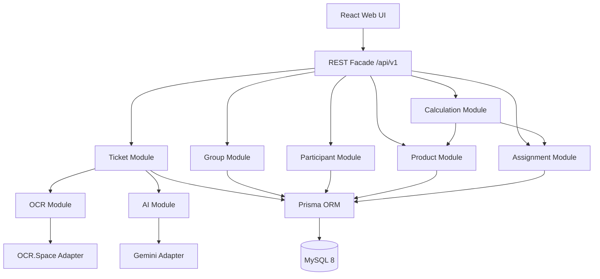
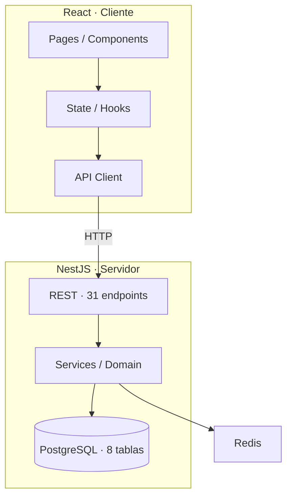
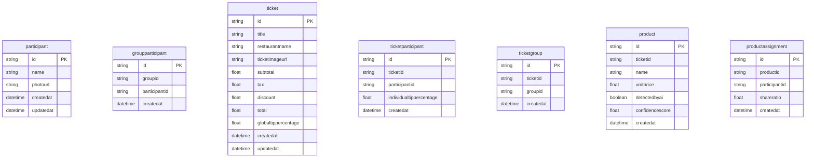

# Master Design Document — SplitSnap

---
## [ARQUITECTURA - SECCIÓN INMUTABLE] CONFIGURACIÓN DE PATRONES DE DESARROLLO

> ### 🚨 NOTA DE SISTEMA PARA AGENTES DE IA (PROHIBIDO ELIMINAR O MODIFICAR)
> Esta sección contiene las decisiones de diseño arquitectónico globales del proyecto. 
> ANTES de generar cualquier documento posterior (Spec, Arq, API, Flujos, Tasks, Infra), DEBES leer obligatoriamente las opciones marcadas con [X] en este Wizard. Toda especificación, contrato, diagrama o tarea técnica generada debe alinearse estrictamente con los patrones activados.

### Patrones activos (SSOT)

*Selección vigente del proyecto. Para cambiarla usa «Editar patrones (SSOT)» en el Workshop.*

_Ningún patrón seleccionado. Usa «Editar patrones (SSOT)»._

---
**Proyecto:** SplitSnap — Divisor inteligente de cuentas de restaurante  
**Versión MDD:** 1.1  
**Estado:** Draft — listo para pegar en The Forge (panel MDD → Fuente)  
**Fuentes:** BRD v1.1, Fase 0, PRD, Database Design, API Spec, AI Spec, UX Flow

---
## 1. Contexto ### Propósito y resultado de negocio **SplitSnap** es una aplicación web que digitaliza tickets de restaurante mediante fotografía, interpreta productos con IA y calcula cuánto debe pagar cada comensal según lo que consumió (no división uniforme del total). **Resultado medible (MVP):** completar la división de una cuenta en **menos de 2 minutos**, con asignación por consumo real, IVA proporcional, descuentos proporcionales y propina configurable. ### Fronteras | En alcance (MVP) | Fuera de alcance (MVP) |
| --- | --- |
| Tickets, participantes, grupos, productos, asignaciones | Login / registro / multiusuario |
| OCR + IA para estructurar ticket | App móvil nativa |
| Cálculo automático (compartidos, IVA, descuentos, propina) | Pagos electrónicos / bancos |
| Historial en base de datos del despliegue | Sync en nube entre dispositivos |
| Grupos reutilizables | Estadísticas avanzadas, export PDF |
| Web responsive mobile-first | IA que asigna productos automáticamente | ### Mapa de contextos (DDD) - **Core:** división de cuenta, asignación producto↔participante, motor de cálculo.
- **Colindantes (integración):** OCR.Space (texto), Gemini 2.5 Flash (JSON estructurado).
- **Fuera:** identidad de usuarios, pagos, colaboración en tiempo real. ### Actores | Actor | Descripción |
| --- | --- |
| **Usuario operador** | Persona que usa la app en su dispositivo; paga el total y organiza la división. **No hay login en MVP.** |
| **Participante** | Entidad de negocio (nombre y/o foto); **no** es usuario del sistema. | ### Glosario (Ubiquitous Language) | Término | Definición |
| --- | --- |
| **Ticket** | Cuenta de restaurante a dividir |
| **Producto** | Ítem del ticket (detectado por IA o manual); precio > 0 |
| **Participante** | Comensal que debe pagar parte de la cuenta |
| **Grupo** | Conjunto reutilizable de participantes frecuentes |
| **Asignación** | Vínculo producto ↔ participante con `shareRatio` |
| **Producto compartido** | Producto asignado a N participantes; costo repartido por ratios |
| **Modo propina** | `GLOBAL` (un %) o `INDIVIDUAL` (% por persona) | ### Bloqueantes de negocio (HITL) | ID | Bloqueante | Resolución |
| --- | --- | --- |
| HITL-01 | Umbral alerta total calculado vs impreso | Product Owner — antes de desarrollo |
| HITL-02 | Formato compartir resultado con comensales | Product Owner — antes de desarrollo |
| HITL-03 | Límite máximo participantes por ticket | Product Owner — antes de desarrollo | ### Criterios de aceptación (UAT — referencia BRD) - **UAT-01:** Foto legible → productos estructurados y editables.
- **UAT-02:** Asignación múltiple + impuestos proporcionales correctos.
- **UAT-03:** Cambio global → individual hereda % global.
- **UAT-04:** Eliminar participante redistribuye compartidos; producto huérfano bloquea finalizar.
- **UAT-05:** Añadir participante tardío permite reasignar productos existentes. ---
## 2. Arquitectura y Stack

### 2.1 Decisiones técnicas

| Componente | Tecnología | Decisión / ¿Por qué? |
| --- | --- | --- |
| Runtime | Node.js 20 LTS | Ecosistema alineado al PRD; despliegue simple |
| Backend | Express.js + TypeScript | API REST documentada en PRD; simplicidad MVP |
| Frontend | React 18 + Vite + TypeScript | PRD y UX mobile-first |
| Estilos | Tailwind CSS | PRD; responsive rápido |
| Routing web | React Router | Navegación SPA |
| HTTP cliente | Axios | Consumo API desde web |
| ORM | Prisma 5.x | Productividad + tipado; PRD |
| Base de datos | MySQL 8 | PRD y Database Design |
| Validación | Zod (API) + validación frontend | Coherencia DTOs |
| OCR | OCR.Space (adapter) | AI Spec — plan gratuito MVP |
| LLM | Gemini 2.5 Flash (adapter) | AI Spec — interpretación ticket |
| Almacenamiento imágenes | Local / referencia URL en BD (MVP) | PRD; Cloudinary/S3 post-MVP |

**No usar en MVP:** NestJS, PostgreSQL, Redis, React Native, JWT, microservicios, colas de eventos, Pub/Sub.

### 2.2 Screaming Architecture (monolito modular)

```text
splitsnap/
├── apps/web/                 # React + Vite
└── apps/api/
    └── src/
        ├── modules/
        │   ├── ticket/
        │   ├── participant/
        │   ├── group/
        │   ├── product/
        │   ├── assignment/
        │   ├── ocr/
        │   ├── ai/
        │   └── calculation/
        ├── controllers/
        ├── services/
        ├── repositories/
        ├── middlewares/
        ├── routes/
        ├── validators/
        └── config/
```

### 2.3 Justificación de patrones

- **Hexagonal:** puertos `OcrPort`, `TicketParserPort`, `TicketRepository`; adapters intercambiables.
- **Monolito modular:** un proceso Node; módulos desacoplados por dominio.
- **Facade:** Express expone `/api/v1/*`; oculta OCR/IA/BD al frontend.
- **Template Method:** `CalculationService.calculate()` ejecuta los pasos en orden fijo.
- **Strategy:** `GlobalTipStrategy` / `IndividualTipStrategy`.
- **State:** `processingStatus` del ticket guía UI y reglas de transición.
- **Chain of Responsibility:** pipeline imagen → OCR → preprocesador → Gemini → auditor → reglas.
- **Circuit Breaker:** en adapters OCR/Gemini; fallback a ingreso manual.

### 2.4 Diagrama de componentes



### 2.5 Objetivos de rendimiento (MVP)

| Operación | Objetivo |
| --- | --- |
| OCR | ≤ 5 s |
| Gemini (interpretación) | ≤ 5 s |
| Cálculo final | ≤ 500 ms |
| Carga pantalla principal | < 2 s |

---
### Diagrama de componentes propuesto



_Propuesta derivada de §2–§4: capas inferidas del stack, entidades SQL y contratos API documentados (determinista, sin servicios inventados)._
## 3. Modelo de Datos

### 3.1 Filosofía

- **3NF**, integridad referencial, claves foráneas.
- **No persistir datos derivados** por participante (subtotal, propina, total individual); se calculan en runtime.
- **Asignaciones** guardan `shareRatio`, no montos (Database Design §17).
- Reparto equitativo MVP: cada participante asignado recibe `shareRatio = 1`.
- Ticket guarda `subtotal`, `tax`, `discount`, `total` como **referencia del escaneo** (editables), no como totales por persona.

### 3.2 Esquema SQL (MySQL 8)

```sql
CREATE TABLE `Group` (
  id            CHAR(36) PRIMARY KEY,
  name          VARCHAR(100) NOT NULL,
  description   VARCHAR(255) NULL,
  createdAt     DATETIME NOT NULL DEFAULT CURRENT_TIMESTAMP,
  updatedAt     DATETIME NOT NULL DEFAULT CURRENT_TIMESTAMP ON UPDATE CURRENT_TIMESTAMP,
  INDEX idx_group_name (name)
);
CREATE TABLE Participant (
  id            CHAR(36) PRIMARY KEY,
  name          VARCHAR(100) NULL,
  photoUrl      VARCHAR(500) NULL,
  createdAt     DATETIME NOT NULL DEFAULT CURRENT_TIMESTAMP,
  updatedAt     DATETIME NOT NULL DEFAULT CURRENT_TIMESTAMP ON UPDATE CURRENT_TIMESTAMP,
  CONSTRAINT chk_participant_identity CHECK (name IS NOT NULL OR photoUrl IS NOT NULL),
  INDEX idx_participant_name (name)
);
CREATE TABLE GroupParticipant (
  id            CHAR(36) PRIMARY KEY,
  groupId       CHAR(36) NOT NULL,
  participantId CHAR(36) NOT NULL,
  createdAt     DATETIME NOT NULL DEFAULT CURRENT_TIMESTAMP,
  UNIQUE KEY uq_group_participant (groupId, participantId),
  FOREIGN KEY (groupId) REFERENCES `Group`(id) ON DELETE CASCADE,
  FOREIGN KEY (participantId) REFERENCES Participant(id) ON DELETE CASCADE,
  INDEX idx_gp_group (groupId),
  INDEX idx_gp_participant (participantId)
);
CREATE TABLE Ticket (
  id                  CHAR(36) PRIMARY KEY,
  title               VARCHAR(150) NOT NULL,
  restaurantName      VARCHAR(150) NULL,
  ticketImageUrl      VARCHAR(500) NOT NULL,
  subtotal            DECIMAL(10,2) NULL,
  tax                 DECIMAL(10,2) NULL,
  discount            DECIMAL(10,2) NULL DEFAULT 0,
  total               DECIMAL(10,2) NULL,
  tipMode             ENUM('GLOBAL','INDIVIDUAL') NOT NULL DEFAULT 'GLOBAL',
  globalTipPercentage DECIMAL(5,2) NULL,
  processingStatus    ENUM('PENDING','PROCESSING','COMPLETED','FAILED') NOT NULL DEFAULT 'PENDING',
  createdAt           DATETIME NOT NULL DEFAULT CURRENT_TIMESTAMP,
  updatedAt           DATETIME NOT NULL DEFAULT CURRENT_TIMESTAMP ON UPDATE CURRENT_TIMESTAMP,
  INDEX idx_ticket_created (createdAt),
  INDEX idx_ticket_status (processingStatus)
);
CREATE TABLE TicketParticipant (
  id                      CHAR(36) PRIMARY KEY,
  ticketId                CHAR(36) NOT NULL,
  participantId           CHAR(36) NOT NULL,
  individualTipPercentage DECIMAL(5,2) NULL,
  createdAt               DATETIME NOT NULL DEFAULT CURRENT_TIMESTAMP,
  UNIQUE KEY uq_ticket_participant (ticketId, participantId),
  FOREIGN KEY (ticketId) REFERENCES Ticket(id) ON DELETE CASCADE,
  FOREIGN KEY (participantId) REFERENCES Participant(id) ON DELETE RESTRICT,
  INDEX idx_tp_ticket (ticketId),
  INDEX idx_tp_participant (participantId)
);
CREATE TABLE TicketGroup (
  id        CHAR(36) PRIMARY KEY,
  ticketId  CHAR(36) NOT NULL,
  groupId   CHAR(36) NOT NULL,
  createdAt DATETIME NOT NULL DEFAULT CURRENT_TIMESTAMP,
  UNIQUE KEY uq_ticket_group (ticketId, groupId),
  FOREIGN KEY (ticketId) REFERENCES Ticket(id) ON DELETE CASCADE,
  FOREIGN KEY (groupId) REFERENCES `Group`(id) ON DELETE RESTRICT
);
CREATE TABLE Product (
  id              CHAR(36) PRIMARY KEY,
  ticketId        CHAR(36) NOT NULL,
  name            VARCHAR(150) NOT NULL,
  unitPrice       DECIMAL(10,2) NOT NULL,
  detectedByAI    BOOLEAN NOT NULL DEFAULT FALSE,
  confidenceScore DECIMAL(5,2) NULL,
  createdAt       DATETIME NOT NULL DEFAULT CURRENT_TIMESTAMP,
  CONSTRAINT chk_product_price CHECK (unitPrice > 0),
  FOREIGN KEY (ticketId) REFERENCES Ticket(id) ON DELETE CASCADE,
  INDEX idx_product_ticket (ticketId),
  INDEX idx_product_name (name)
);
CREATE TABLE ProductAssignment (
  id            CHAR(36) PRIMARY KEY,
  productId     CHAR(36) NOT NULL,
  participantId CHAR(36) NOT NULL,
  shareRatio    DECIMAL(10,4) NOT NULL,
  createdAt     DATETIME NOT NULL DEFAULT CURRENT_TIMESTAMP,
  CONSTRAINT chk_share_ratio CHECK (shareRatio > 0),
  UNIQUE KEY uq_product_participant (productId, participantId),
  FOREIGN KEY (productId) REFERENCES Product(id) ON DELETE CASCADE,
  FOREIGN KEY (participantId) REFERENCES Participant(id) ON DELETE CASCADE,
  INDEX idx_pa_product (productId),
  INDEX idx_pa_participant (participantId)
);
```

### Diagrama entidad-relación



### 3.4 Reglas de integridad

- Todo producto pertenece a un ticket; precio > 0.
- Todo producto debe tener al menos una asignación antes de finalizar.
- No duplicar participante en el mismo ticket ni en el mismo grupo.
- Propina individual: `individualTipPercentage` entre 0 y 100 cuando `tipMode = INDIVIDUAL`.
- Al eliminar participante: se eliminan sus asignaciones; producto sin asignación bloquea finalize.
- Un participante puede pertenecer a varios grupos.

---
```TechnicalMetadata
[high_security]
```

-----
## 4. Contratos de API

**Base URL:** `/api/v1`  
**Formato:** JSON; imágenes `multipart/form-data`  
**Éxito:** `{ "success": true, "message": "...", "data": { ... } }`  
**Error:** `{ "success": false, "message": "...", "error": { "code": "...", "details": ... } }`

4.A API del producto

| Método | Ruta | Descripción |
| --- | --- | --- |
| GET | `/health` | Estado servidor, BD, OCR, Gemini |
| GET | `/groups` | Listar grupos |
| POST | `/groups` | Crear grupo |
| GET | `/groups/{id}` | Detalle grupo |
| PUT | `/groups/{id}` | Actualizar grupo |
| DELETE | `/groups/{id}` | Eliminar grupo |
| POST | `/participants` | Crear participante |
| PUT | `/participants/{id}` | Actualizar participante |
| DELETE | `/participants/{id}` | Eliminar participante |
| POST | `/tickets` | Crear ticket |
| GET | `/tickets` | Listar tickets |
| GET | `/tickets/{id}` | Detalle ticket |
| DELETE | `/tickets/{id}` | Eliminar ticket |
| POST | `/tickets/{id}/participants` | Agregar participante al ticket |
| DELETE | `/tickets/{id}/participants/{participantId}` | Quitar participante |
| POST | `/products` | Agregar producto manual |
| PUT | `/products/{id}` | Editar producto |
| DELETE | `/products/{id}` | Eliminar producto |
| GET | `/tickets/{ticketId}/assignments` | Listar asignaciones |
| POST | `/assignments` | Asignar producto a 1 participante |
| POST | `/assignments/shared` | Asignar producto compartido |
| DELETE | `/assignments/{id}` | Eliminar asignación |
| PUT | `/tickets/{ticketId}/tip` | Modo propina global/individual |
| PUT | `/tickets/{ticketId}/participants/{participantId}/tip` | Propina individual |
| GET | `/tickets/{ticketId}/summary` | Resumen calculado |
| POST | `/tickets/{ticketId}/calculate` | Forzar recálculo |
| GET | `/history` | Historial |
| GET | `/history/{id}` | Detalle histórico |
4.A.1 Pipeline inteligente

| Método | Ruta | Descripción |
| --- | --- | --- |
| POST | `/ocr` | Solo OCR → texto |
| POST | `/ai/parse-ticket` | Texto OCR → JSON |
| POST | `/tickets/process` | Pipeline completo imagen → OCR → Gemini → productos |
4.A.2 Ejemplo POST /api/v1/tickets/process

Request: `multipart/form-data`, campo `image` (JPG/JPEG/PNG)

```json
{
  "success": true,
  "message": "Ticket procesado correctamente.",
  "data": {
    "ticket": {
      "id": "uuid",
      "restaurantName": "Pizza House",
      "subtotal": 365,
      "tax": 58.4,
      "total": 423.4,
      "processingStatus": "COMPLETED"
    },
    "products": [
      {
        "id": "uuid",
        "name": "Pizza Pepperoni",
        "unitPrice": 320,
        "detectedByAI": true
      },
      {
        "id": "uuid",
        "name": "Refresco",
        "unitPrice": 45,
        "detectedByAI": true
      }
    ]
  }
}
```

4.A.3 Ejemplo GET /api/v1/tickets/{ticketId}/summary

```json
{
  "success": true,
  "data": {
    "participants": [
      {
        "participantId": "uuid",
        "name": "Juan",
        "subtotal": 250,
        "taxPortion": 40,
        "discountPortion": 0,
        "subtotalWithTax": 290,
        "tip": 29,
        "total": 319
      }
    ],
    "grandTotal": 1045
  }
}
```

4.B Integraciones externas

| Proveedor | Puerto | Auth | Límite MVP |
| --- | --- | --- | --- |
| OCR.Space | `OcrPort.extractText(image)` | API key en env | Timeout 5 s; Circuit Breaker |
| Gemini 2.5 Flash | `TicketParserPort.parse(cleanText)` | API key en env | Timeout 5 s; interpretar + auditar |
JSON esperado de IA:

```json
{
  "restaurant": "Pizza House",
  "items": [
}
{
  "name": "Pizza Pepperoni",
  "price": 320,
    { "name": "Refresco", "price": 45 }
  ],
  "subtotal": 365,
  "tax": 58.4,
  "discount": 0,
  "total": 423.4
}
La IA no asigna productos ni calcula división por persona.

---
## 5. Lógica y Edge Cases

### 5.1 Motor de cálculo (Template Method)

1. Obtener productos y asignaciones (`shareRatio`).
2. Monto por participante en producto: `unitPrice × (shareRatio / Σ shareRatio del producto)`.
3. Subtotal individual = suma de montos asignados.
4. Porción IVA = `(subtotalIndividual / Σ subtotales) × tax`.
5. Porción descuento = `(subtotalIndividual / Σ subtotales) × discount`.
6. Subtotal con impuestos = subtotal + porción IVA − porción descuento.
7. Propina = subtotalConImpuestos × (tip% / 100).
8. Total individual = subtotalConImpuestos + propina.
9. Total general = suma de totales individuales.

### 5.2 Validación y calidad de datos

- Finalizar requiere ≥1 participante, ≥1 producto, todos los productos asignados, precios > 0.
- Participante: al menos `name` o `photoUrl`.
- Imagen: JPG/JPEG/PNG; máximo configurable (ej. 5 MB).
- Si diferencia entre total calculado e impreso supera umbral → alerta y corrección manual.

### 5.3 Resiliencia y terceros

- Circuit Breaker en OCR/Gemini; mensaje claro e ingreso manual si falla.
- Códigos: `OCR_ERROR`, `AI_PARSE_ERROR`, `VALIDATION_ERROR`, `EXTERNAL_SERVICE_UNAVAILABLE`.
- Reintento con backoff (máx. 3) solo en adapters.

### 5.4 Consistencia y transacciones

- Operaciones multi-tabla en transacción Prisma cuando aplique.
- Eliminar producto → cascade en asignaciones.
- Eliminar participante → confirmación UI → redistribuir compartidos.

### 5.5 Ciclo de vida del ticket (State)

`PENDING` → `PROCESSING` → `COMPLETED` | `FAILED`

### 5.6 Escenarios Gherkin
```gherkin
Escenario: Producto compartido equitativo
  Dado un ticket con pizza de $300 asignada a Juan, Pedro y Luis con shareRatio 1
  Cuando se ejecuta el cálculo
  Entonces cada uno debe tener $100 de subtotal por esa pizza antes de IVA y propina
```

```gherkin
Escenario: Eliminar único asignado
  Dado un producto asignado solo a Ana
  Cuando el operador elimina a Ana y confirma
  Entonces el producto queda sin asignar
  Y el sistema impide finalizar hasta reasignar o eliminar el producto
```

```gherkin
Escenario: Propina global a individual
  Dado propina global del 10%
  Cuando el operador cambia a modo individual
  Entonces todos los participantes tienen 10% como valor inicial
```

```gherkin
Escenario: Fallo OCR
  Dado una imagen ilegible
  Cuando OCR.Space falla o devuelve texto vacío
  Entonces el sistema muestra error claro
  Y permite agregar productos manualmente

---
## 6. Seguridad

### Alcance MVP (sin autenticación)

SplitSnap MVP **no expone login ni registro**. No aplican JWT, bcrypt, RBAC ni bloqueo por intentos fallidos.

| Control | Implementación |
| --- | --- |
| Transporte | HTTPS en producción (TLS 1.2+) |
| Headers | Helmet |
| CORS | Origen del frontend configurable |
| Rate limiting | Por IP; más estricto en OCR/IA |
| Validación | Zod en body; MIME y tamaño en uploads |
| Secretos | OCR y Gemini solo en servidor (env) |
| SQL | Prisma parametrizado |
| IA | Validar JSON del LLM con reglas de negocio |

### Post-MVP

Si se añade login o sync en nube, revisar OWASP ASVS completo.
---
Bloqueo de cuenta tras 5 intentos fallidos de login en ventana de 15 minutos; lockout 5 minutos (OWASP ASVS V3.1.1).

## 7. Infraestructura

### 7.1 Despliegue MVP

| Servicio | Stack | Notas |
| --- | --- | --- |
| web | Nginx + Vite build | SPA React |
| api | Node 20 + Express | Puerto 3000 |
| mysql | MySQL 8 | Volumen persistente |
| storage | Filesystem | Imágenes ticket |

### 7.2 Variables de entorno

| Variable | Requerida | Descripción |
| --- | --- | --- |
| DATABASE_URL | Sí | MySQL (Prisma) |
| PORT | No | Default 3000 |
| NODE_ENV | Sí | development / production |
| OCR_SPACE_API_KEY | Sí | OCR.Space |
| GEMINI_API_KEY | Sí | Google Gemini |
| CORS_ORIGIN | Sí | URL frontend |
| MAX_UPLOAD_MB | No | Default 5 |
| CALC_TOTAL_VARIANCE_THRESHOLD | No | Umbral alerta (HITL-01) |

### Manifest de Infraestructura

```json
{
  "servicios": {
    "api": {
      "puerto": 3000,
      "variables": [
        "DATABASE_URL",
        "OCR_SPACE_API_KEY",
        "GEMINI_API_KEY",
        "CORS_ORIGIN"
      ]
    },
    "mysql": {
      "puerto": 3306,
      "persistencia": "10Gi"
    },
    "web": {
      "puerto": 80,
      "proxy_api": "/api → api:3000"
    }
  },
  "integraciones": {
    "ocr_space": {
      "timeout_ms": 5000
    },
    "gemini": {
      "model": "gemini-2.5-flash",
      "timeout_ms": 5000
    }
  }
}
```

### 7.4 Monitoreo

- `GET /api/v1/health` → status de BD, OCR y Gemini.
- Logs en errores de adapters sin exponer API keys.
---
## UI/UX Design Intent

> Directrices de alto nivel para UI. El mapa ejecutable **pantalla → ruta → componente UI → API** vive en `pantallas.md`. **No** uses tabla entidad→componente ni `GET /api/v1/{tabla}` genéricos.

### Personas y journeys

**Usuario autenticado** accede al producto con objetivos concretos del dominio descrito en §1. Su journey principal combina autenticación, navegación en `AppLayout` y tareas sobre datos del modelo §3 (8 entidades) sin asumir un CRUD por tabla. Las pantallas, rutas y APIs ejecutables se documentan en `pantallas.md` y deben trazarse a historias de usuario.

El flujo transversal conecta onboarding, operación diaria y tareas puntuales (formularios, listados, feedback). Prioriza journeys completos sobre pantallas aisladas por entidad; estados `loading`, `empty` y `error` son obligatorios en login, dashboard y listados principales.

### Matriz pantalla→componente

Detalle ejecutable en **`pantallas.md`** (spec-kit). Resumen de columnas obligatorias:

| Ruta | Componentes UI | API (api-contracts) | Estados |
|------|----------------|---------------------|---------|
| _ver pantallas.md_ | _catálogo MCP activo o shadcn_ | _método + ruta exacta_ | _loading, empty, error_ |

Roles con nav: `Usuario autenticado`. Cada fila de `pantallas.md` debe trazarse a una US con **🎨 Criterios UI**.

### Reglas de composición

- **Formularios** = componente formulario del stack + schema Zod alineado al DTO de `api-contracts.md`.
- **Listados** = tabla + filtros + paginación (nombres según `pantallas.md` / MCP activo); bajo `md` → cards apiladas.
- **Dashboard** = KPIs + gráficas según catálogo activo; sin duplicar métricas sin US.
- **Pipeline arrastrable (Kanban)** solo si el journey lo exige (validar en `pantallas.md`).
- Endpoints **solo** de `api-contracts.md`; tokens **solo** de `design-system.md`.

### Componentes transversales

- **Layout shell** (`AppLayout` o equivalente): nav por rol (ítems, iconos, orden); rutas protegidas JWT (`role`, `tenant_id`).
- **Estado vacío:** CTA contextual en listados sin datos.
- **Toast / feedback:** éxito tras POST/PUT; errores API cerca del formulario o banner.
- **Modales globales:** impersonación, quota LLM 80%/100% (documentar trigger en Tasks).
- **Responsive:** sm 640 / md 768 / lg 1024 / xl 1280; touch ≥ 44×44px; WCAG AA.

### Fuera de alcance UI v1

- CRUD admin por entidad §3 sin endpoint en `api-contracts.md`.
- Pipeline arrastrable (Kanban) en entidades técnicas (sesiones OTP, audit logs, outbox).
- Pipeline visual para `Ticket`, `TicketParticipant`, `TicketGroup` — solo si una US lo exige explícitamente.

### Referencia cruzada

| Artefacto | Rol |
|---|---|
| `design-system.md` | Tokens, tema, accesibilidad (única SSOT visual) |
| `pantallas.md` | Ruta, componentes UI, API, estados (**gana** sobre Blueprint §8) |
| `ui-project.json` | Prototipo MCP (opcional; solo si el MCP activo lo soporta) |
| `user-stories.md` / `tasks.md` | 🎨 Criterios UI y tareas **por pantalla** |