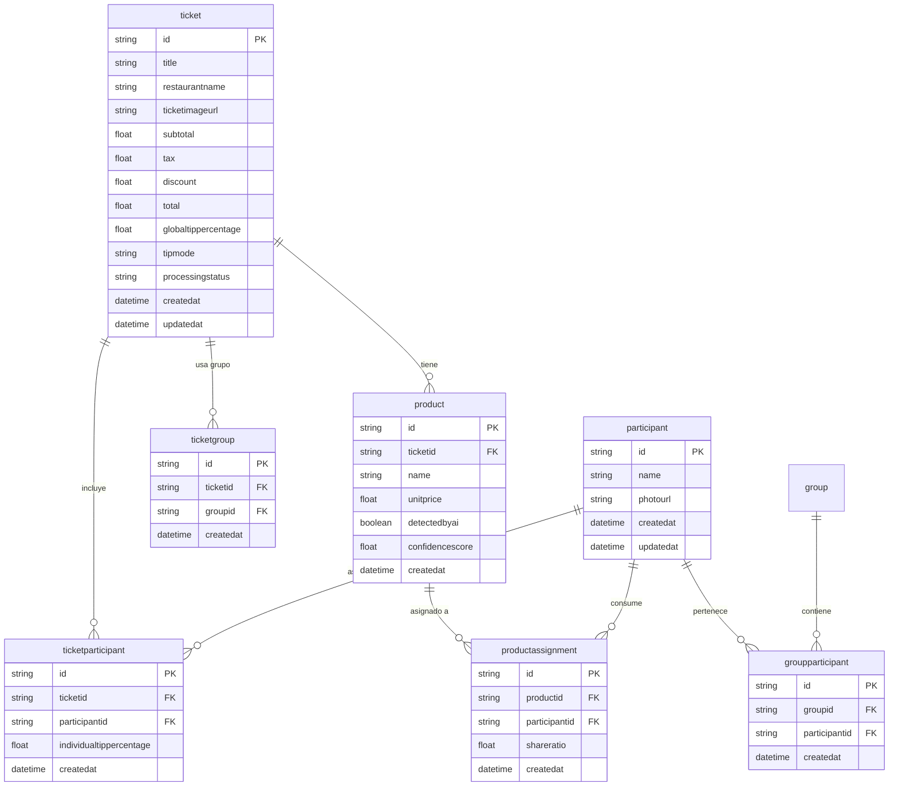
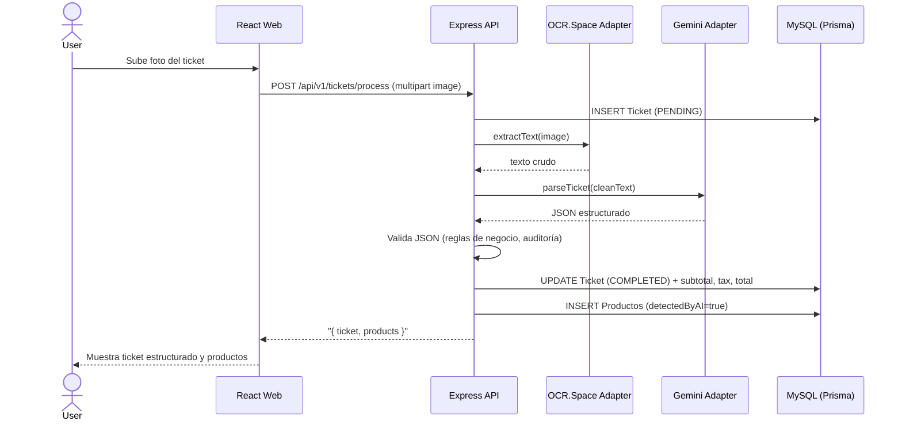
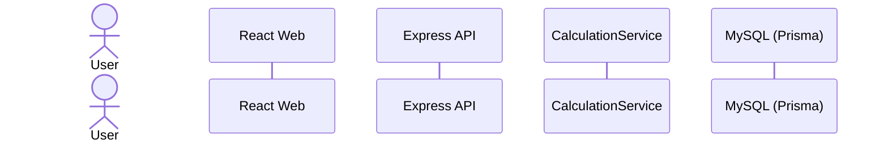

# SplitSnap — Documento de Arquitectura

## 1. Contexto y alcance

SplitSnap es una aplicación web que digitaliza tickets de restaurante mediante fotografía, interpreta los productos con IA (Gemini 2.5 Flash) y calcula cuánto debe pagar cada comensal según lo que consumió. El MVP permite completar la división de una cuenta en menos de 2 minutos, con asignación por consumo real, IVA proporcional, descuentos proporcionales y propina configurable.

**Alcance del sistema documentado:** aplicación web monolítica con backend Express.js + TypeScript y frontend React + Vite. No incluye autenticación de usuarios, pagos electrónicos ni colaboración en tiempo real.

**Actores:**  
- **Usuario operador:** persona que usa la app en su dispositivo; organiza la división.  
- **Participante:** entidad de negocio (nombre y/o foto); no es usuario del sistema.

---

## 2. Vista de módulos / capas

### 2.1 Backend (Express.js + TypeScript)

Estructura de carpetas según el MDD:

```
splitsnap/
├── apps/api/src/
│   ├── modules/
```text
│   │
├── ticket/          # Creación, estado, pipeline OCR+IA
```
```text
│   │
├── participant/     # CRUD de participantes
```
```text
│   │
├── group/           # Grupos reutilizables
```
```text
│   │
├── product/         # Productos del ticket
```
```text
│   │
├── assignment/      # Asignación producto ↔ participante
```
```text
│   │
├── ocr/             # Adapter OCR.Space
```
```text
│   │
├── ai/              # Adapter Gemini 2.5 Flash
```
```text
│   │
└── calculation/     # Motor de cálculo (Template Method)
```
│   ├── controllers/         # Handlers HTTP
│   ├── services/            # Lógica de negocio
│   ├── repositories/        # Prisma queries
│   ├── middlewares/         # Validación, errores, CORS, rate limiting
│   ├── routes/              # Definición de rutas REST
│   ├── validators/          # Schemas Zod
│   └── config/              # Variables de entorno, adapters

**Patrones estructurales aplicados:**
- Hexagonal: puertos `OcrPort`, `TicketParserPort`, `TicketRepository`; adapters intercambiables.
- Monolito modular: un proceso Node; módulos desacoplados por dominio.
- Facade: Express expone `/api/v1/*`; oculta OCR/IA/BD al frontend.

### 2.2 Frontend (React 18 + Vite + TypeScript + Tailwind CSS)

apps/web/
├── src/
│   ├── pages/               # Vistas: Home, Ticket, Participants, Summary, History
│   ├── components/          # UI reutilizables (shadcn/ui o similar)
│   ├── hooks/               # Estado y lógica de formularios
│   ├── services/            # Axios client hacia API
│   ├── stores/              # Estado global (React Context o Zustand)
│   └── utils/               # Formateo, validación

### 2.3 Capas compartidas

- Schemas Zod compartidos entre frontend y backend para validación de DTOs.
- Tipos TypeScript para modelos de dominio.

---

## 3. Modelo y persistencia

### 3.1 Esquema SQL (MySQL 8, Prisma ORM)

El modelo sigue 3NF con integridad referencial. Se persisten solo datos fuente; ningún dato derivado (subtotal, propina, total individual) se almacena, se calcula en runtime.

| Tabla               | Descripción                                       | PK      | FK                       |
| :------------------ | :------------------------------------------------ | :------ | :----------------------- |
| `Group`             | Grupo reutilizable de participantes               | id UUID | -                        |
| `Participant`       | Comensal (nombre y/o foto)                        | id UUID | -                        |
| `GroupParticipant`  | Relación grupo ↔ participante                     | id UUID | groupId, participantId   |
| `Ticket`            | Cuenta de restaurante escaneada                   | id UUID | -                        |
| `TicketParticipant` | Participante asignado a un ticket                 | id UUID | ticketId, participantId  |
| `TicketGroup`       | Grupo vinculado a un ticket                       | id UUID | ticketId, groupId        |
| `Product`           | Ítem del ticket                                   | id UUID | ticketId                 |
| `ProductAssignment` | Asignación producto ↔ participante con shareRatio | id UUID | productId, participantId |
**Reglas de integridad relevantes:**
- `Product.unitPrice > 0`
- `ProductAssignment.shareRatio > 0`
- `Participant` debe tener al menos `name` o `photoUrl`
- `Ticket.processingStatus` ∈ {PENDING, PROCESSING, COMPLETED, FAILED}
- `Ticket.tipMode` ∈ {GLOBAL, INDIVIDUAL}
- `tipPercentage` global e individual entre 0 y 100
- Producto sin asignación bloquea finalizar ticket
- Eliminar participante elimina en cascada sus asignaciones

### 3.2 Diagrama entidad-relación



---

## 4. APIs y contratos

**Base URL:** `/api/v1`  
**Formato:** JSON; imágenes `multipart/form-data`  
**Respuesta éxito:** `{ "success": true, "message": "...", "data": { ... } }`  
**Respuesta error:** `{ "success": false, "message": "...", "error": { "code": "...", "details": ... } }`

### 4.1 Endpoints REST

| Método | Ruta                                                 | Descripción                                        |
| :----- | :--------------------------------------------------- | :------------------------------------------------- |
| GET    | `/health`                                            | Estado servidor, BD, OCR, Gemini                   |
| GET    | `/groups`                                            | Listar grupos                                      |
| POST   | `/groups`                                            | Crear grupo                                        |
| GET    | `/groups/:id`                                        | Detalle grupo                                      |
| PUT    | `/groups/:id`                                        | Actualizar grupo                                   |
| DELETE | `/groups/:id`                                        | Eliminar grupo                                     |
| POST   | `/participants`                                      | Crear participante                                 |
| PUT    | `/participants/:id`                                  | Actualizar participante                            |
| DELETE | `/participants/:id`                                  | Eliminar participante                              |
| POST   | `/tickets`                                           | Crear ticket                                       |
| GET    | `/tickets`                                           | Listar tickets                                     |
| GET    | `/tickets/:id`                                       | Detalle ticket                                     |
| DELETE | `/tickets/:id`                                       | Eliminar ticket                                    |
| POST   | `/tickets/:id/participants`                          | Agregar participante al ticket                     |
| DELETE | `/tickets/:id/participants/:participantId`           | Quitar participante                                |
| POST   | `/products`                                          | Agregar producto manual                            |
| PUT    | `/products/:id`                                      | Editar producto                                    |
| DELETE | `/products/:id`                                      | Eliminar producto                                  |
| GET    | `/tickets/:ticketId/assignments`                     | Listar asignaciones                                |
| POST   | `/assignments`                                       | Asignar producto a 1 participante                  |
| POST   | `/assignments/shared`                                | Asignar producto compartido (varios participantes) |
| DELETE | `/assignments/:id`                                   | Eliminar asignación                                |
| PUT    | `/tickets/:ticketId/tip`                             | Modo propina global/individual                     |
| PUT    | `/tickets/:ticketId/participants/:participantId/tip` | Propina individual                                 |
| GET    | `/tickets/:ticketId/summary`                         | Resumen calculado                                  |
| POST   | `/tickets/:ticketId/calculate`                       | Forzar recálculo                                   |
| GET    | `/history`                                           | Historial de tickets                               |
| GET    | `/history/:id`                                       | Detalle histórico                                  |

### 4.2 Pipeline inteligente (OCR + IA)

| Método | Ruta               | Descripción                                                               |
| :----- | :----------------- | :------------------------------------------------------------------------ |
| POST   | `/ocr`             | OCR puro → texto crudo                                                    |
| POST   | `/ai/parse-ticket` | Texto OCR → JSON estructurado                                             |
| POST   | `/tickets/process` | Pipeline completo: imagen → OCR → IA → persistencia de ticket y productos |
**Ejemplo POST /tickets/process**  
Request: `multipart/form-data`, campo `image` (JPG/JPEG/PNG)  
Response:
```json
{
  "success": true,
  "message": "Ticket procesado correctamente.",
  "data": {
    "ticket": {
      "id": "uuid",
      "restaurantName": "Pizza House",
      "subtotal": 365,
      "tax": 58.4,
      "total": 423.4,
      "processingStatus": "COMPLETED"
    },
    "products": [
      { "id": "uuid", "name": "Pizza Pepperoni", "unitPrice": 320, "detectedByAI": true },
      { "id": "uuid", "name": "Refresco", "unitPrice": 45, "detectedByAI": true }
    ]
  }
```

**Ejemplo GET /tickets/:id/summary**  
Response:

```json
{
  "success": true,
  "data": {
    "participants": [
      {
        "participantId": "uuid",
        "name": "Juan",
        "subtotal": 250,
        "taxPortion": 40,
        "discountPortion": 0,
        "subtotalWithTax": 290,
        "tip": 29,
        "total": 319
      }

    ],
    "grandTotal": 1045
  }

### 4.3 Integraciones externas

| Proveedor        | Puerto                              | Auth           | Comportamiento                                                            |
| :--------------- | :---------------------------------- | :------------- | :------------------------------------------------------------------------ |
| OCR.Space        | `OcrPort.extractText(image)`        | API key en env | Timeout 5 s; Circuit Breaker; fallback a ingreso manual                   |
| Gemini 2.5 Flash | `TicketParserPort.parse(cleanText)` | API key en env | Timeout 5 s; devuelve JSON estructurado; validación con reglas de negocio |

```

**JSON esperado de IA:**

```json
{
  "restaurant": "Pizza House",
  "items": [
    { "name": "Pizza Pepperoni", "price": 320 },
    { "name": "Refresco", "price": 45 }
  ],
  "subtotal": 365,
  "tax": 58.4,
  "discount": 0,
  "total": 423.4

```

---

## 5. Flujos relevantes

### 5.1 Pipeline de procesamiento de ticket



### 5.2 Cálculo de división (Template Method)mermaid



```
### User->>WebUI: Asigna productos a participantes y solicita resumen
- WebUI->>API: GET /api/v1/tickets/:id/summary
- API->>Calc: calculate(ticketId)
- Calc->>DB: Obtener productos, asignaciones, participantes, tipMode
- Calc->>Calc: Paso 1: Monto por participante por producto (shareRatio)
- Calc->>Calc: Paso 2: Subtotal individual
- Calc->>Calc: Paso 3: Porción IVA (proporcional)
- Calc->>Calc: Paso 4: Porción descuento (proporcional)
- Calc->>Calc: Paso 5: Subtotal con impuestos
- Calc->>Calc: Paso 6: Propina (global o individual)
- Calc->>Calc: Paso 7: Total individual
- Calc->>Calc: Paso 8: Total general
- Calc-->>API: { participants, grandTotal }
- API-->>WebUI: Resumen calculado
- WebUI-->>User: Muestra desglose por persona

---

## 6. Seguridad, observabilidad e infraestructura

### 6.1 Seguridad (MVP sin autenticación)

| Control               | Implementación                                                      |
| :-------------------- | :------------------------------------------------------------------ |
| Transporte            | HTTPS en producción (TLS 1.2+)                                      |
| Headers de seguridad  | Helmet middleware                                                   |
| CORS                  | Origen del frontend configurable (`CORS_ORIGIN`)                    |
| Rate limiting         | Por IP; más estricto en endpoints /ocr y /ai                        |
| Validación de entrada | Zod en body y query params; MIME y tamaño en uploads                |
| Secretos              | OCR.Space y Gemini API keys solo en servidor (variables de entorno) |
| SQL injection         | Prisma ORM con consultas parametrizadas                             |
| Validación de IA      | JSON del LLM validado contra reglas de negocio antes de persistir   |

### 6.2 Observabilidad

- **Health endpoint:** `GET /api/v1/health` devuelve estado de BD, OCR y Gemini.
- **Logging:** Logs de errores en adapters externos sin exponer API keys.
- **Códigos de error:** `OCR_ERROR`, `AI_PARSE_ERROR`, `VALIDATION_ERROR`, `EXTERNAL_SERVICE_UNAVAILABLE`.

### 6.3 Infraestructura (MVP)

| Servicio       | Stack                    | Puerto | Notas                                      |
| :------------- | :----------------------- | :----- | :----------------------------------------- |
| Web            | Nginx + Vite build (SPA) | 80     | Proxy reverso `/api` → API                 |
| API            | Node.js 20 + Express     | 3000   | Proceso único                              |
| Base de datos  | MySQL 8                  | 3306   | Volumen persistente                        |
| Almacenamiento | Filesystem local         | -      | Imágenes de tickets (referencia URL en BD) |
**Variables de entorno requeridas:**

| Variable                        | Descripción                                      |
| :------------------------------ | :----------------------------------------------- |
| `DATABASE_URL`                  | Cadena de conexión MySQL (Prisma)                |
| `OCR_SPACE_API_KEY`             | API key de OCR.Space                             |
| `GEMINI_API_KEY`                | API key de Google Gemini                         |
| `CORS_ORIGIN`                   | URL del frontend                                 |
| `PORT`                          | Puerto del API (default 3000)                    |
| `NODE_ENV`                      | development / production                         |
| `MAX_UPLOAD_MB`                 | Tamaño máximo de imagen (default 5)              |
| `CALC_TOTAL_VARIANCE_THRESHOLD` | Umbral de alerta entre total calculado e impreso |
---

## 7. Evolución y riesgos (propuesta)

**Futuras mejoras (post-MVP, a evaluar):**
- Autenticación y autorización (JWT, OWASP ASVS completo).
- Sincronización en nube entre dispositivos (Cloudinary/S3 para imágenes, BD centralizada).
- Pagos electrónicos integrados.
- Asignación automática de productos por IA (actualmente fuera de alcance).
- Exportación a PDF y estadísticas avanzadas.

**Riesgos identificados:**
- Dependencia de servicios externos (OCR.Space, Gemini) – mitigado con Circuit Breaker y fallback manual.
- Umbral de alerta entre total calculado e impreso requiere definición del Product Owner (HITL-01).
- Sin autenticación, los datos son locales al dispositivo; para multi-dispositivo se requiere login.

---

## Registro de cambios del documento

| Versión | Fecha      | Descripción del cambio                                            |
| :------ | :--------- | :---------------------------------------------------------------- |
| 1.0     | Abril 2026 | Creación inicial del documento de Arquitectura basado en MDD v1.1 |