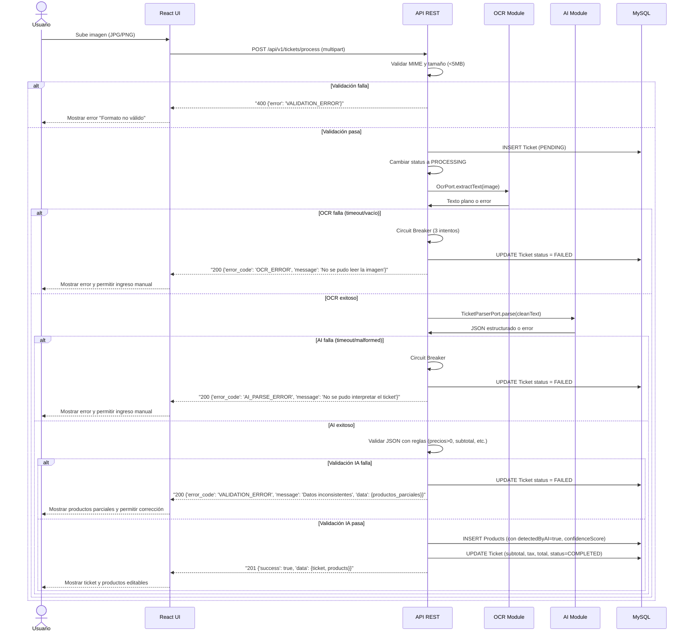
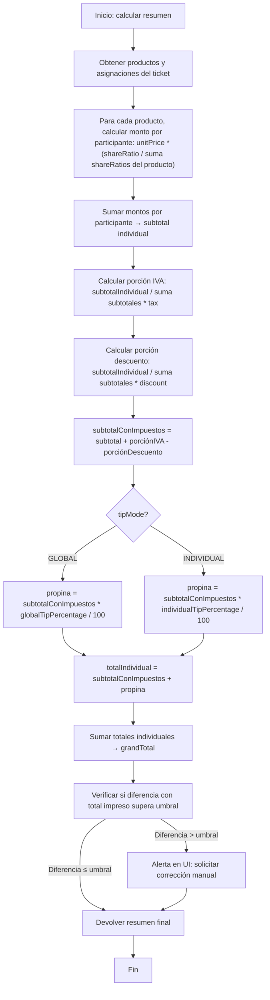

# Casos de Uso y Flujos de Lógica — SplitSnap

## 1. Diagrama de Secuencia — Flujo Completo de Procesamiento de Ticket



## 2. Diagrama de Flujo — Motor de Cálculo (Template Method)


## 3. Flujos de Error y Reintentos

### 3.1 Fallo en OCR (UAT-01 — escenario fallo)
1. **Web** envía imagen a `POST /api/v1/tickets/process`.
2. **API** valida formato y tamaño. Si falla, responde `400` y el usuario corrige.
3. **API** llama a `OcrPort.extractText(image)`.
4. **OCR.Space** no responde en 5s o devuelve texto vacío.
5. **Circuit Breaker** registra fallo. Si hay menos de 3 intentos, reintenta con backoff exponencial (1s, 2s, 4s).
6. Tras 3 fallos, el ticket se marca `FAILED` y la API responde:
   ```json
   {
     "success": false,
     "error": { "code": "OCR_ERROR", "details": "No se pudo leer la imagen. Ingresa los productos manualmente." }
   }

7. **Web** muestra un mensaje claro y activa el formulario de ingreso manual de productos.
8. El usuario puede agregar/modificar productos sin necesidad de reprocesar la imagen.
```
### 3.2 Fallo en IA (Gemini)
1. OCR exitoso, se envía texto limpio a `TicketParserPort.parse()`.
2. Gemini no responde en 5s o devuelve JSON malformado.
3. Circuit Breaker reintenta hasta 3 veces.
4. Tras fallo, ticket `FAILED`. API responde con `AI_PARSE_ERROR`.
5. Web muestra mensaje: "No se pudo interpretar el ticket. Puedes agregar los productos manualmente."
6. El usuario tiene acceso a la imagen original y puede escribir los productos.

### 3.3 Diferencia de total (HITL-01)
1. Se ejecuta `calculate()`.
2. El total calculado (grandTotal) difiere del total impreso en más del umbral configurable (por defecto 5%).
3. La API incluye en la respuesta `summary` una alerta:
   ```json
   { "alert": "Diferencia detectada: total calculado $423.40 vs impreso $450.00. Revisa los datos." }

4. Web muestra un banner naranja con opción a "Corregir ticket" (editar subtotal, tax, descuento) o "Ignorar y continuar".
```
## 4. Reglas de Validación

| Campo / Entidad                       | Regla                                                                   | Código de error    |
| :------------------------------------ | :---------------------------------------------------------------------- | :----------------- |
| Imagen ticket                         | MIME: `image/jpeg`, `image/png`; tamaño ≤ 5 MB (configurable)           | `VALIDATION_ERROR` |
| Nombre participante                   | Al menos 1 carácter si se proporciona, o `photoUrl` debe ser URL válida | `VALIDATION_ERROR` |
| Precio producto                       | `unitPrice > 0` (decimal con 2 dígitos)                                 | `VALIDATION_ERROR` |
| `shareRatio`                          | `> 0` (decimal con 4 dígitos)                                           | `VALIDATION_ERROR` |
| `tipPercentage` (global o individual) | Entre 0 y 100 (decimal con 2 dígitos)                                   | `VALIDATION_ERROR` |
| `processingStatus`                    | Solo transiciones: `PENDING → PROCESSING → COMPLETED                    | FAILED`            |
| Propina individual                    | Solo permitido cuando `tipMode = INDIVIDUAL`                            | `STATE_ERROR`      |
| Eliminar participante                 | Confirmación UI; si producto queda sin asignación, bloquea finalizar    | `ORPHAN_PRODUCT`   |
| Finalizar ticket                      | Requiere ≥1 participante, ≥1 producto, todos los productos asignados    | `VALIDATION_ERROR` |
| Duplicado participante en ticket      | Unique key `(ticketId, participantId)`                                  | `DUPLICATE_ENTRY`  |
| Duplicado grupo-participante          | Unique key `(groupId, participantId)`                                   | `DUPLICATE_ENTRY`  |

## 5. Casos de Borde

### 5.1 Eliminar participante con productos compartidos (UAT-04)
1. Usuario elimina a "Ana" que tiene asignaciones en productos compartidos.
2. API elimina todas las `ProductAssignment` de Ana (cascade).
3. Si algún producto compartido se queda sin ninguna asignación, el sistema no permite finalizar el ticket.
4. Web muestra un mensaje: "El producto 'Pizza' no tiene asignaciones. Reasígnelo o elimínelo."
5. El usuario puede reasignar el producto a otro participante o eliminar el producto.

### 5.2 Añadir participante tardío (UAT-05)
1. Ticket ya tiene productos y asignaciones.
2. Usuario agrega un nuevo participante "Luis" al ticket.
3. Web muestra los productos existentes con opción de asignar a Luis (compartido o exclusivo).
4. Si Luis se asigna a un producto ya compartido, se recalcula el `shareRatio` (todos los asignados con ratio 1).
5. Si no se asigna a ningún producto, su total será 0 (aunque puede tener propina si es individual).

### 5.3 Cambio de modo propina (UAT-03)
1. Ticket con `tipMode = GLOBAL`, `globalTipPercentage = 10`.
2. Usuario cambia a `tipMode = INDIVIDUAL` mediante `PUT /tickets/{id}/tip`.
3. API asigna `individualTipPercentage = 10` a cada `TicketParticipant` existente.
4. Si luego se agrega un nuevo participante, su `individualTipPercentage` será `null` hasta que se configure.
5. Web muestra un campo editable por participante con valor inicial 10.

### 5.4 Producto huérfano después de editar asignaciones
1. Usuario elimina la única asignación de un producto.
2. API responde con éxito, pero el producto queda sin asignación.
3. Al intentar finalizar, API valida y devuelve error `ORPHAN_PRODUCT`.
4. Web resalta el producto huérfano y obliga a asignarlo o eliminarlo.

### 5.5 Umbral de diferencia y corrección manual
1. Tras cálculo, diferencia > umbral (5% por defecto).
2. Usuario puede editar `subtotal`, `tax`, `discount` del ticket.
3. Al guardar, se recalcula el resumen automáticamente.
4. Si la diferencia persiste, se sigue mostrando la alerta hasta que el usuario la ignore explícitamente.

### 5.6 Timeout en operación de cálculo
1. Si el cálculo toma más de 500ms (objetivo), la API devuelve `200` con los datos disponibles hasta ese momento (parciales).
2. No se emplea reintento automático; el usuario puede solicitar recálculo explícito vía `POST /tickets/{id}/calculate`.
3. Se registra en logs de monitoreo.

## 6. Cumplimiento con el MDD

- **Lógica de negocio (§5.1)** : El motor de cálculo sigue el Template Method descrito, incluyendo IVA, descuento y propina proporcionales. Los diagramas de secuencia y flujo reflejan exactamente los pasos.
- **Consistencia y transacciones (§5.4)** : Se modelan operaciones multi-tabla en una transacción Prisma (ej: creación de ticket + productos). La eliminación de participante usa cascade de BD.
- **Resiliencia (§5.3)** : Los flujos de error implementan Circuit Breaker con reintentos y fallback a ingreso manual. Los códigos de error (`OCR_ERROR`, `AI_PARSE_ERROR`, `VALIDATION_ERROR`) coinciden con los definidos.
- **Ciclo de vida del ticket (§5.5)** : Las transiciones de estado `PENDING → PROCESSING → COMPLETED | FAILED` se validan en cada operación, y el diagrama de secuencia las muestra.
- **Validación de datos (§5.2)** : Se incluyen todas las reglas de validación del MDD (precio>0, shareRatio>0, imagen, etc.) y se añaden los códigos de error correspondientes.
- **Escenarios Gherkin (§5.6)** : Cada escenario está cubierto en los casos de borde (UAT-02, UAT-04, UAT-03, UAT-01 fallo).
- **Seguridad (§6)** : Sin autenticación en MVP, pero se validan MIME, tamaño, rate limiting y Helmet. Los flujos de error no exponen secretos.

## Registro de cambios del documento

| Versión | Fecha     | Descripción del cambio |
| :------ | :-------- | :--------------------- |
| 1.0     | Mayo 2026 |                        |