# Documento de Casos de Uso – SplitSnap

## Caso de Uso 1: Crear Grupo

| Campo                   | Detalle                                                                                                                                                                                                                                                                                                                                                                                                                                                                    |
| :---------------------- | :------------------------------------------------------------------------------------------------------------------------------------------------------------------------------------------------------------------------------------------------------------------------------------------------------------------------------------------------------------------------------------------------------------------------------------------------------------------------- |
| **Nombre**              | Crear Grupo                                                                                                                                                                                                                                                                                                                                                                                                                                                                |
| **Actor Principal**     | Usuario operador                                                                                                                                                                                                                                                                                                                                                                                                                                                           |
| **Precondiciones**      | El usuario operador tiene acceso a la interfaz web. No hay autenticación.                                                                                                                                                                                                                                                                                                                                                                                                  |
| **Flujo Principal**     | 1. El usuario operador navega a la sección de grupos. 2. El sistema muestra un formulario de creación de grupo. 3. El usuario ingresa nombre (obligatorio) y descripción (opcional). 4. El usuario envía el formulario. 5. El sistema valida que el nombre no esté vacío y no exceda 100 caracteres. 6. El sistema crea el grupo en la base de datos con `id` UUID, `name`, `description`, `createdAt`, `updatedAt`. 7. El sistema retorna el grupo creado con código 201. |
| **Flujos Alternativos** | **2a. Nombre duplicado:** El sistema verifica que el nombre no exista previamente (índice `idx_group_name`). Si existe, retorna error `VALIDATION_ERROR` con mensaje "El nombre del grupo ya existe". **2b. Error de base de datos:** Si la conexión falla, el sistema retorna error 500 con código `INTERNAL_ERROR`.                                                                                                                                                      |
| **Postcondiciones**     | Se crea un registro en la tabla `Group`. El grupo queda disponible para ser asociado a tickets.                                                                                                                                                                                                                                                                                                                                                                            |
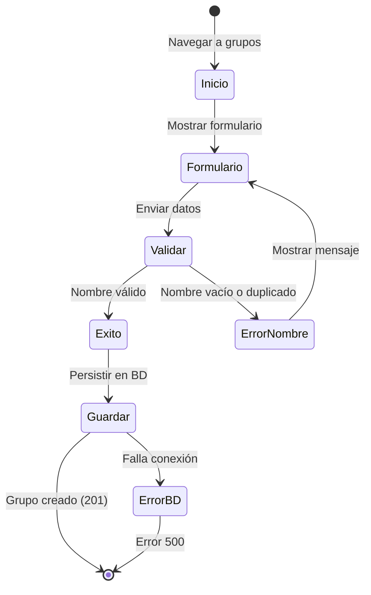
## Caso de Uso 2: Listar Grupos

| Campo                   | Detalle                                                                                                                                                                                                                                                                                                             |
| :---------------------- | :------------------------------------------------------------------------------------------------------------------------------------------------------------------------------------------------------------------------------------------------------------------------------------------------------------------ |
| **Nombre**              | Listar Grupos                                                                                                                                                                                                                                                                                                       |
| **Actor Principal**     | Usuario operador                                                                                                                                                                                                                                                                                                    |
| **Precondiciones**      | El usuario operador tiene acceso a la interfaz web.                                                                                                                                                                                                                                                                 |
| **Flujo Principal**     | 1. El usuario operador navega a la sección de grupos. 2. El sistema realiza una petición GET a `/api/v1/groups`. 3. El sistema consulta la tabla `Group` y retorna todos los registros ordenados por `createdAt` descendente. 4. El sistema muestra la lista de grupos en la interfaz (nombre, descripción, fecha). |
| **Flujos Alternativos** | **3a. Sin grupos:** Si no existen grupos, el sistema retorna un arreglo vacío y la UI muestra un estado vacío con un CTA para crear el primer grupo. **3b. Error de base de datos:** El sistema retorna error 500.                                                                                                  |
| **Postcondiciones**     | Ninguna.                                                                                                                                                                                                                                                                                                            |
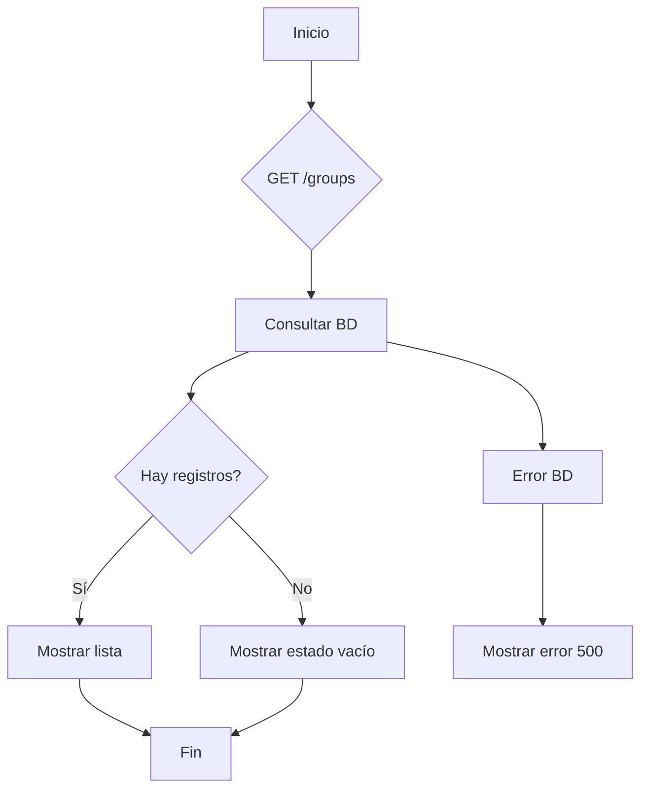
## Caso de Uso 3: Crear Participante

| Campo                   | Detalle                                                                                                                                                                                                                                                                                              |
| :---------------------- | :--------------------------------------------------------------------------------------------------------------------------------------------------------------------------------------------------------------------------------------------------------------------------------------------------- |
| **Nombre**              | Crear Participante                                                                                                                                                                                                                                                                                   |
| **Actor Principal**     | Usuario operador                                                                                                                                                                                                                                                                                     |
| **Precondiciones**      | El usuario operador está en la interfaz de creación de participante.                                                                                                                                                                                                                                 |
| **Flujo Principal**     | 1. El usuario ingresa nombre (opcional) y/o URL de foto (opcional). 2. El sistema valida que al menos uno de los campos esté presente (CHECK: `name IS NOT NULL OR photoUrl IS NOT NULL`). 3. El sistema crea el participante en la tabla `Participant` con UUID. 4. Retorna el participante creado. |
| **Flujos Alternativos** | **2a. Sin nombre ni foto:** El sistema retorna error `VALIDATION_ERROR` con mensaje "Debe proporcionar al menos un nombre o una foto". **2b. URL de foto inválida:** Si la URL excede 500 caracteres, error de validación.                                                                           |
| **Postcondiciones**     | Se crea un registro en `Participant`. El participante puede ser agregado a tickets y grupos.                                                                                                                                                                                                         |
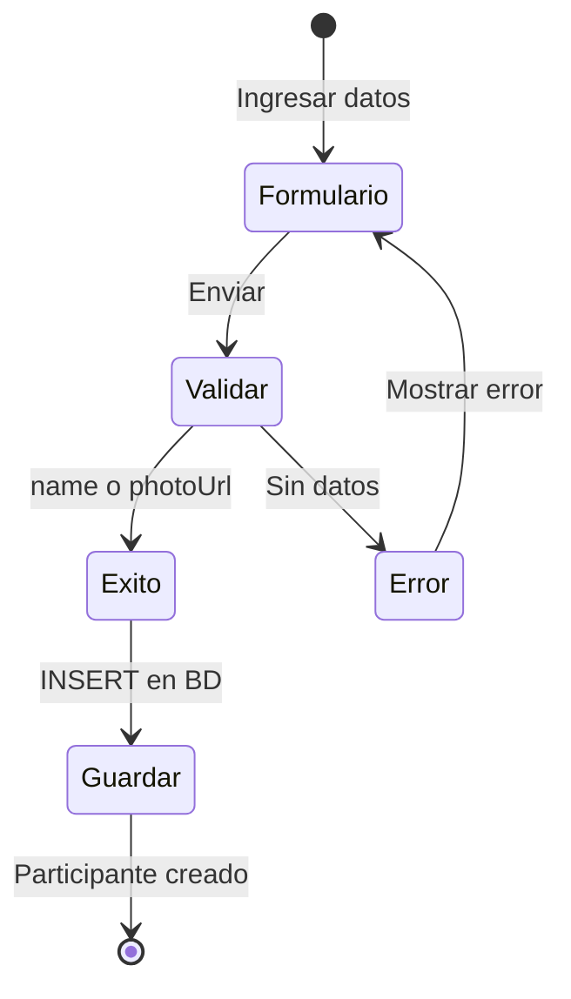
## Caso de Uso 4: Procesar Ticket (Pipeline Inteligente)

| Campo                   | Detalle                                                                                                                                                                                                                                                                                                                                                                                                                                                                                                                                                                                                                                                                                                                                                                                                                                                                     |
| :---------------------- | :-------------------------------------------------------------------------------------------------------------------------------------------------------------------------------------------------------------------------------------------------------------------------------------------------------------------------------------------------------------------------------------------------------------------------------------------------------------------------------------------------------------------------------------------------------------------------------------------------------------------------------------------------------------------------------------------------------------------------------------------------------------------------------------------------------------------------------------------------------------------------- |
| **Nombre**              | Procesar Ticket (Pipeline completo)                                                                                                                                                                                                                                                                                                                                                                                                                                                                                                                                                                                                                                                                                                                                                                                                                                         |
| **Actor Principal**     | Usuario operador                                                                                                                                                                                                                                                                                                                                                                                                                                                                                                                                                                                                                                                                                                                                                                                                                                                            |
| **Precondiciones**      | El usuario operador tiene una imagen de ticket (JPG/JPEG/PNG) en su dispositivo. No hay autenticación.                                                                                                                                                                                                                                                                                                                                                                                                                                                                                                                                                                                                                                                                                                                                                                      |
| **Flujo Principal**     | 1. El usuario selecciona una imagen y la envía mediante `POST /api/v1/tickets/process` (multipart/form-data). 2. El sistema crea un ticket en estado `PENDING` con `ticketImageUrl` (ruta local). 3. El sistema cambia estado a `PROCESSING`. 4. El sistema envía la imagen a OCR.Space (adapter) con timeout de 5s. 5. OCR.Space devuelve texto estructurado. 6. El sistema envía el texto a Gemini 2.5 Flash (adapter) con timeout de 5s. 7. Gemini devuelve JSON con `restaurant`, `items`, `subtotal`, `tax`, `discount`, `total`. 8. El sistema valida el JSON: cada item con `name` y `price > 0`. 9. El sistema crea productos en la tabla `Product` con `detectedByAI = true` y `confidenceScore`. 10. El sistema actualiza el ticket con `restaurantName`, `subtotal`, `tax`, `discount`, `total`, `processingStatus = COMPLETED`. 11. Retorna ticket y productos. |
| **Flujos Alternativos** | **4a. Imagen inválida:** MIME no permitido o tamaño > 5MB → error `VALIDATION_ERROR`. **4b. OCR falla:** OCR.Space timeout o texto vacío → Circuit Breaker, error `OCR_ERROR`, ticket pasa a `FAILED`, UI permite ingreso manual. **4c. Gemini falla:** Timeout o JSON malformado → error `AI_PARSE_ERROR`, ticket `FAILED`, permite ingreso manual. **4d. Productos con precio 0:** Gemini devuelve precio 0 → error de validación, se marca como `FAILED`, se pide corrección manual.                                                                                                                                                                                                                                                                                                                                                                                     |
| **Postcondiciones**     | Ticket creado con productos detectados. El ticket está en estado `COMPLETED` o `FAILED`.                                                                                                                                                                                                                                                                                                                                                                                                                                                                                                                                                                                                                                                                                                                                                                                    |
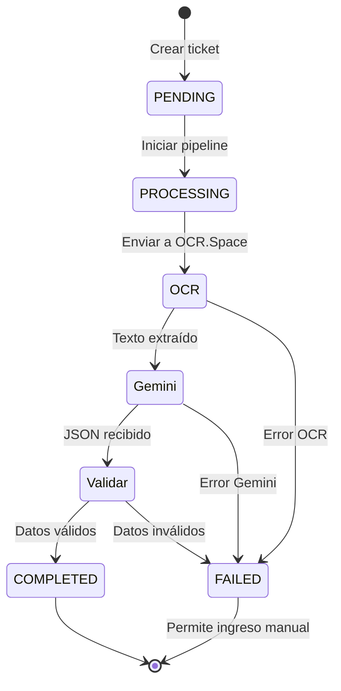
## Caso de Uso 5: Agregar Participante al Ticket

| Campo                   | Detalle                                                                                                                                                                                                                                                                                                                                                                                                                 |
| :---------------------- | :---------------------------------------------------------------------------------------------------------------------------------------------------------------------------------------------------------------------------------------------------------------------------------------------------------------------------------------------------------------------------------------------------------------------- |
| **Nombre**              | Agregar Participante al Ticket                                                                                                                                                                                                                                                                                                                                                                                          |
| **Actor Principal**     | Usuario operador                                                                                                                                                                                                                                                                                                                                                                                                        |
| **Precondiciones**      | Existe un ticket en estado `COMPLETED` o `FAILED`. Existe un participante previamente creado.                                                                                                                                                                                                                                                                                                                           |
| **Flujo Principal**     | 1. El usuario operador selecciona un ticket y un participante existente. 2. El sistema envía `POST /api/v1/tickets/{id}/participants` con `participantId`. 3. El sistema verifica que el participante no esté ya en el ticket (unique key `uq_ticket_participant`). 4. El sistema crea un registro en `TicketParticipant` con `individualTipPercentage = NULL` (inicialmente sin propina individual). 5. Retorna éxito. |
| **Flujos Alternativos** | **3a. Participante ya agregado:** Error `VALIDATION_ERROR` con mensaje "El participante ya está en este ticket". **3b. Ticket no existe:** Error 404. **3c. Participante no existe:** Error 404.                                                                                                                                                                                                                        |
| **Postcondiciones**     | El participante queda asociado al ticket. Puede recibir asignaciones de productos.                                                                                                                                                                                                                                                                                                                                      |
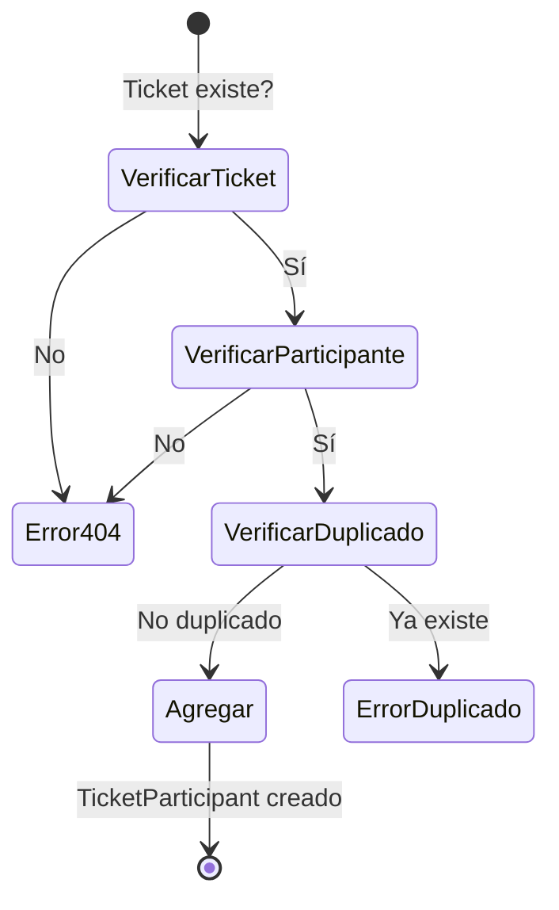
## Caso de Uso 6: Asignar Producto a Participante (Individual)

| Campo                   | Detalle                                                                                                                                                                                                                                                                                                                                                                                            |
| :---------------------- | :------------------------------------------------------------------------------------------------------------------------------------------------------------------------------------------------------------------------------------------------------------------------------------------------------------------------------------------------------------------------------------------------- |
| **Nombre**              | Asignar Producto a Participante (Individual)                                                                                                                                                                                                                                                                                                                                                       |
| **Actor Principal**     | Usuario operador                                                                                                                                                                                                                                                                                                                                                                                   |
| **Precondiciones**      | Ticket existe con productos. Participante está asociado al ticket.                                                                                                                                                                                                                                                                                                                                 |
| **Flujo Principal**     | 1. El usuario selecciona un producto y un participante. 2. El sistema envía `POST /api/v1/assignments` con `productId`, `participantId`, `shareRatio = 1`. 3. El sistema verifica que el producto pertenezca al ticket y el participante esté en el ticket. 4. El sistema verifica que no exista asignación previa (unique key `uq_product_participant`). 5. Crea la asignación. 6. Retorna éxito. |
| **Flujos Alternativos** | **4a. Asignación duplicada:** Error `VALIDATION_ERROR`. **4b. Producto no pertenece al ticket:** Error 404. **4c. Participante no asociado al ticket:** Error 400.                                                                                                                                                                                                                                 |
| **Postcondiciones**     | Producto asignado a un participante. El producto ya no está "huérfano".                                                                                                                                                                                                                                                                                                                            |
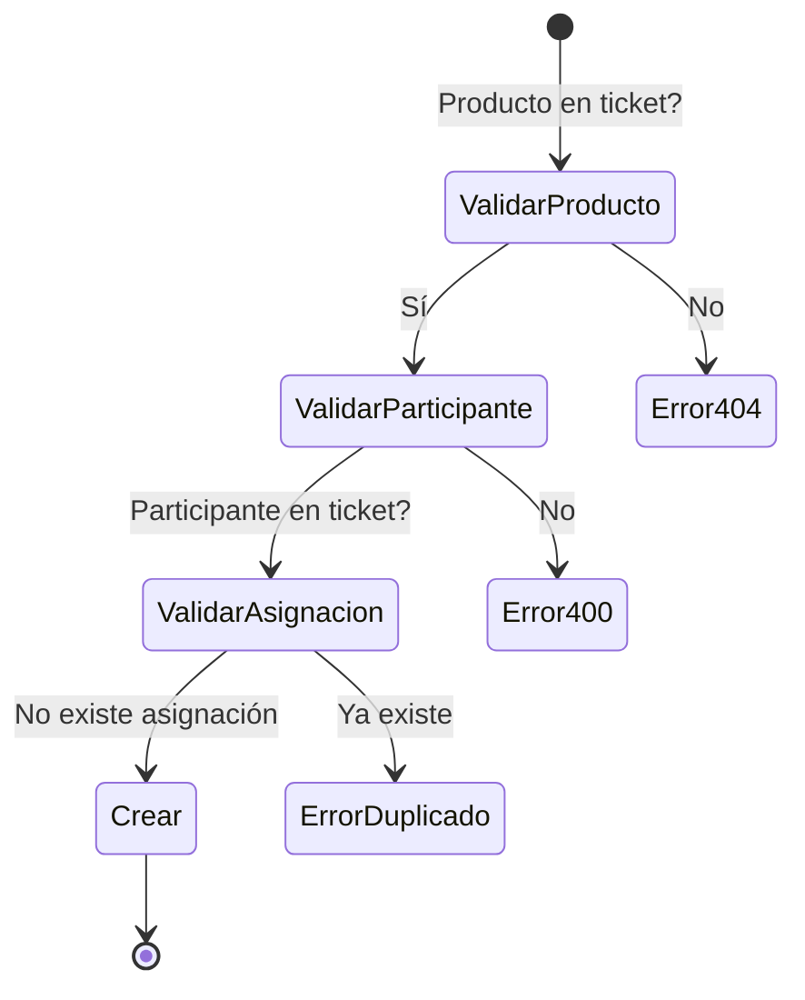
## Caso de Uso 7: Asignar Producto Compartido

| Campo                   | Detalle                                                                                                                                                                                                                                                                                                                                                                                        |
| :---------------------- | :--------------------------------------------------------------------------------------------------------------------------------------------------------------------------------------------------------------------------------------------------------------------------------------------------------------------------------------------------------------------------------------------- |
| **Nombre**              | Asignar Producto Compartido                                                                                                                                                                                                                                                                                                                                                                    |
| **Actor Principal**     | Usuario operador                                                                                                                                                                                                                                                                                                                                                                               |
| **Precondiciones**      | Ticket existe con productos. Al menos dos participantes asociados al ticket.                                                                                                                                                                                                                                                                                                                   |
| **Flujo Principal**     | 1. El usuario selecciona un producto y varios participantes. 2. El sistema envía `POST /api/v1/assignments/shared` con `productId`, `participants: [{participantId, shareRatio}]`. 3. Para cada participante, el sistema verifica que esté en el ticket y que no tenga asignación previa. 4. Crea asignaciones con `shareRatio` especificado (por defecto 1). 5. Retorna asignaciones creadas. |
| **Flujos Alternativos** | **3a. Participante no en ticket:** Error 400. **3b. Asignación duplicada para algún participante:** Error 400. **3c. shareRatio ≤ 0:** Error `VALIDATION_ERROR`. **3d. Solo un participante:** El sistema podría permitirlo, pero se recomienda usar asignación individual.                                                                                                                    |
| **Postcondiciones**     | Producto asignado a múltiples participantes con ratios.                                                                                                                                                                                                                                                                                                                                        |
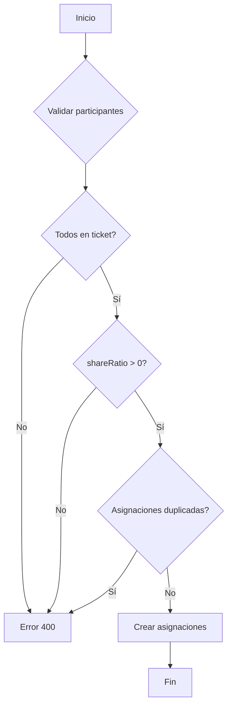
## Caso de Uso 8: Calcular Resumen del Ticket

| Campo                   | Detalle                                                                                                                                                                                                                                                                                                                                                                                                                                                                                                                                                                                                                                                                                                                                                                                                                      |
| :---------------------- | :--------------------------------------------------------------------------------------------------------------------------------------------------------------------------------------------------------------------------------------------------------------------------------------------------------------------------------------------------------------------------------------------------------------------------------------------------------------------------------------------------------------------------------------------------------------------------------------------------------------------------------------------------------------------------------------------------------------------------------------------------------------------------------------------------------------------------- |
| **Nombre**              | Calcular Resumen del Ticket                                                                                                                                                                                                                                                                                                                                                                                                                                                                                                                                                                                                                                                                                                                                                                                                  |
| **Actor Principal**     | Usuario operador                                                                                                                                                                                                                                                                                                                                                                                                                                                                                                                                                                                                                                                                                                                                                                                                             |
| **Precondiciones**      | Ticket en estado `COMPLETED`. Al menos 1 participante, 1 producto, todos los productos asignados.                                                                                                                                                                                                                                                                                                                                                                                                                                                                                                                                                                                                                                                                                                                            |
| **Flujo Principal**     | 1. El usuario solicita el resumen (`GET /api/v1/tickets/{ticketId}/summary`). 2. El sistema ejecuta el motor de cálculo (Template Method): 2.1 Obtiene productos y asignaciones con `shareRatio`. 2.2 Para cada participante, calcula monto por producto: `unitPrice × (shareRatio / Σ shareRatio del producto)`. 2.3 Suma subtotal individual. 2.4 Calcula porción IVA: `(subtotalIndividual / Σ subtotales) × tax`. 2.5 Calcula porción descuento: `(subtotalIndividual / Σ subtotales) × discount`. 2.6 Subtotal con impuestos = subtotal + porción IVA − porción descuento. 2.7 Propina: si `tipMode = GLOBAL`, usa `globalTipPercentage`; si `INDIVIDUAL`, usa `individualTipPercentage` de cada participante. 2.8 Total individual = subtotalConImpuestos + propina. 3. Retorna JSON con participantes y `grandTotal`. |
| **Flujos Alternativos** | **2a. Producto huérfano:** Si algún producto no tiene asignaciones, el sistema retorna error `VALIDATION_ERROR` con mensaje "Todos los productos deben estar asignados". **2b. Sin participantes:** Error 400. **2c. Sin productos:** Error 400. **2d. Diferencia con total impreso supera umbral:** Si `CALC_TOTAL_VARIANCE_THRESHOLD` está configurado y la diferencia entre `grandTotal` y `total` del ticket supera el umbral, el sistema incluye una advertencia en la respuesta.                                                                                                                                                                                                                                                                                                                                       |
| **Postcondiciones**     | Ninguna (cálculo en runtime, no persiste).                                                                                                                                                                                                                                                                                                                                                                                                                                                                                                                                                                                                                                                                                                                                                                                   |
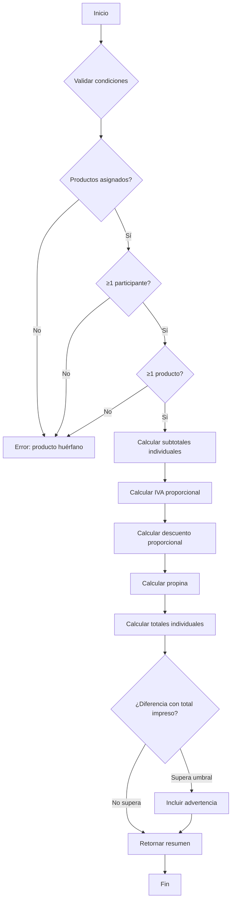
## Caso de Uso 9: Cambiar Modo de Propina (Global a Individual)

| Campo                   | Detalle                                                                                                                                                                                                                                                                                                                                                                                                                                                      |
| :---------------------- | :----------------------------------------------------------------------------------------------------------------------------------------------------------------------------------------------------------------------------------------------------------------------------------------------------------------------------------------------------------------------------------------------------------------------------------------------------------- |
| **Nombre**              | Cambiar Modo de Propina                                                                                                                                                                                                                                                                                                                                                                                                                                      |
| **Actor Principal**     | Usuario operador                                                                                                                                                                                                                                                                                                                                                                                                                                             |
| **Precondiciones**      | Ticket existe. Hay al menos un participante asociado.                                                                                                                                                                                                                                                                                                                                                                                                        |
| **Flujo Principal**     | 1. El usuario cambia el modo de propina de `GLOBAL` a `INDIVIDUAL` (o viceversa) mediante `PUT /api/v1/tickets/{ticketId}/tip` con `tipMode` y opcionalmente `globalTipPercentage`. 2. Si cambia a `INDIVIDUAL`, el sistema asigna a cada `TicketParticipant` el `individualTipPercentage = globalTipPercentage` anterior (si existía). 3. Si cambia a `GLOBAL`, el sistema limpia todos los `individualTipPercentage` (set a NULL). 4. Actualiza el ticket. |
| **Flujos Alternativos** | **2a. Sin propina global previa:** Si no había `globalTipPercentage`, se asigna 0% a cada participante. **2b. Modo individual a global sin porcentaje:** Error si no se envía `globalTipPercentage`.                                                                                                                                                                                                                                                         |
| **Postcondiciones**     | `tipMode` actualizado. Propinas individuales inicializadas o limpiadas.                                                                                                                                                                                                                                                                                                                                                                                      |
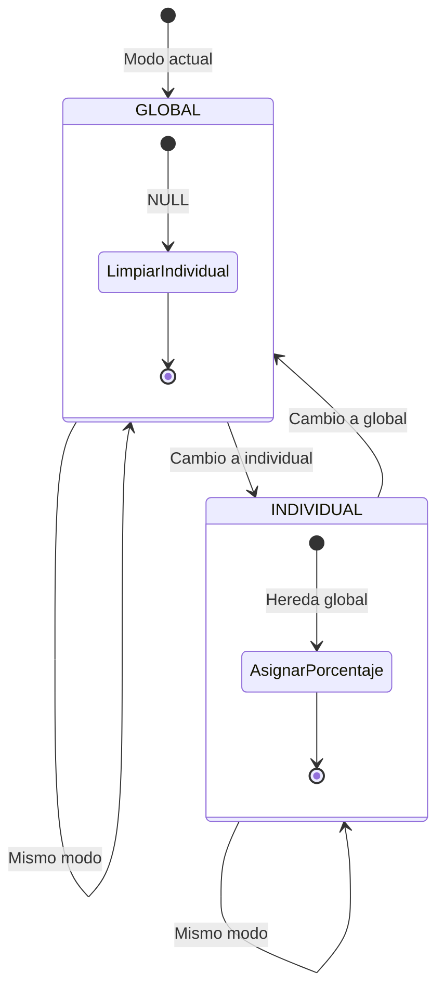
## Caso de Uso 10: Eliminar Participante del Ticket

| Campo                   | Detalle                                                                                                                                                                                                                                                                                                                                                                                                                                                                      |
| :---------------------- | :--------------------------------------------------------------------------------------------------------------------------------------------------------------------------------------------------------------------------------------------------------------------------------------------------------------------------------------------------------------------------------------------------------------------------------------------------------------------------- |
| **Nombre**              | Eliminar Participante del Ticket                                                                                                                                                                                                                                                                                                                                                                                                                                             |
| **Actor Principal**     | Usuario operador                                                                                                                                                                                                                                                                                                                                                                                                                                                             |
| **Precondiciones**      | Ticket existe. Participante asociado al ticket.                                                                                                                                                                                                                                                                                                                                                                                                                              |
| **Flujo Principal**     | 1. El usuario solicita eliminar un participante (`DELETE /api/v1/tickets/{ticketId}/participants/{participantId}`). 2. El sistema muestra confirmación en UI (según §5.4). 3. El usuario confirma. 4. El sistema inicia transacción: elimina todas las asignaciones del participante en el ticket (ProductAssignment), elimina el registro TicketParticipant. 5. Si algún producto queda sin asignaciones, el sistema lo marca como "huérfano". 6. Commit. 7. Retorna éxito. |
| **Flujos Alternativos** | **5a. Producto huérfano:** El sistema no bloquea la eliminación, pero impide finalizar el ticket hasta reasignar o eliminar el producto. **5b. Participante no existe:** Error 404.                                                                                                                                                                                                                                                                                          |
| **Postcondiciones**     | Participante removido del ticket. Asignaciones eliminadas. Posibles productos huérfanos.                                                                                                                                                                                                                                                                                                                                                                                     |
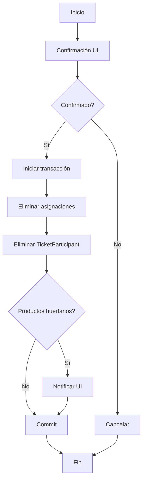
## Caso de Uso 11: Añadir Participante Tardío con Reasignación

| Campo                   | Detalle                                                                                                                                                                                                                                                                                                                                                                               |
| :---------------------- | :------------------------------------------------------------------------------------------------------------------------------------------------------------------------------------------------------------------------------------------------------------------------------------------------------------------------------------------------------------------------------------ |
| **Nombre**              | Añadir Participante Tardío                                                                                                                                                                                                                                                                                                                                                            |
| **Actor Principal**     | Usuario operador                                                                                                                                                                                                                                                                                                                                                                      |
| **Precondiciones**      | Ticket existe con productos ya asignados a otros participantes.                                                                                                                                                                                                                                                                                                                       |
| **Flujo Principal**     | 1. El usuario agrega un nuevo participante al ticket (Caso 5). 2. El sistema permite reasignar productos existentes al nuevo participante. 3. El usuario selecciona productos y los asigna al nuevo participante (Caso 6 o 7). 4. Si se asigna un producto compartido, se actualiza el `shareRatio` de los participantes existentes. 5. El cálculo se actualiza al solicitar resumen. |
| **Flujos Alternativos** | **2a. Sin productos disponibles:** Si todos los productos ya están asignados de forma exclusiva, el usuario puede crear productos manuales (Caso 12).                                                                                                                                                                                                                                 |
| **Postcondiciones**     | Nuevo participante con asignaciones.                                                                                                                                                                                                                                                                                                                                                  |
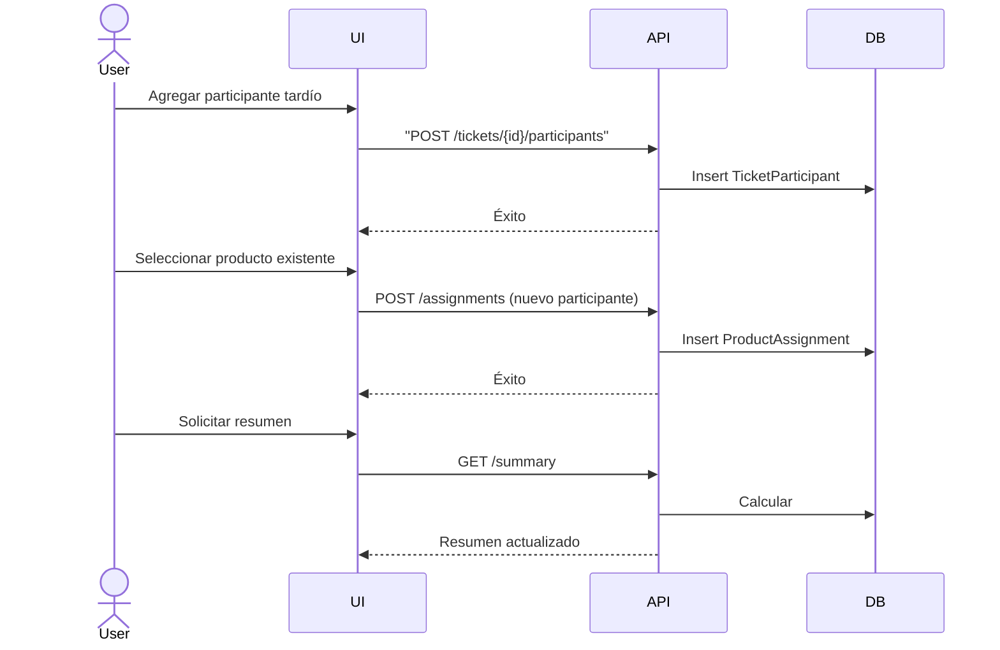
## Caso de Uso 12: Agregar Producto Manual

| Campo                   | Detalle                                                                                                                                                                                                                                                              |
| :---------------------- | :------------------------------------------------------------------------------------------------------------------------------------------------------------------------------------------------------------------------------------------------------------------- |
| **Nombre**              | Agregar Producto Manual                                                                                                                                                                                                                                              |
| **Actor Principal**     | Usuario operador                                                                                                                                                                                                                                                     |
| **Precondiciones**      | Ticket existe.                                                                                                                                                                                                                                                       |
| **Flujo Principal**     | 1. El usuario ingresa nombre y precio unitario. 2. El sistema envía `POST /api/v1/products` con `ticketId`, `name`, `unitPrice`. 3. El sistema valida: `unitPrice > 0`, `name` no vacío. 4. Crea el producto con `detectedByAI = false`. 5. Retorna producto creado. |
| **Flujos Alternativos** | **3a. Precio <= 0:** Error `VALIDATION_ERROR`. **3b. Ticket no existe:** Error 404.                                                                                                                                                                                  |
| **Postcondiciones**     | Producto creado en el ticket. Puede ser asignado.                                                                                                                                                                                                                    |
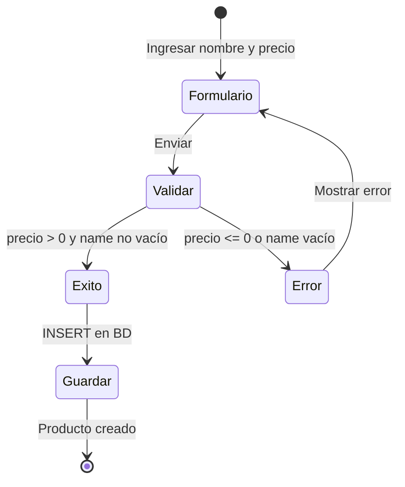
## Caso de Uso 13: Editar Producto

| Campo                   | Detalle                                                                                                                                                                                                      |
| :---------------------- | :----------------------------------------------------------------------------------------------------------------------------------------------------------------------------------------------------------- |
| **Nombre**              | Editar Producto                                                                                                                                                                                              |
| **Actor Principal**     | Usuario operador                                                                                                                                                                                             |
| **Precondiciones**      | Producto existe.                                                                                                                                                                                             |
| **Flujo Principal**     | 1. El usuario modifica nombre o precio. 2. El sistema envía `PUT /api/v1/products/{id}` con `name`, `unitPrice`. 3. El sistema valida precio > 0. 4. Actualiza el producto. 5. Retorna producto actualizado. |
| **Flujos Alternativos** | **3a. Producto no existe:** Error 404. **3b. Precio inválido:** Error 400.                                                                                                                                   |
| **Postcondiciones**     | Producto actualizado.                                                                                                                                                                                        |
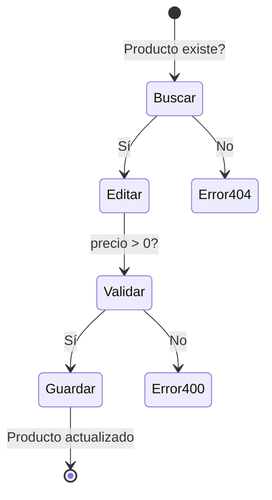
## Caso de Uso 14: Eliminar Producto

| Campo                   | Detalle                                                                                                                                                      |
| :---------------------- | :----------------------------------------------------------------------------------------------------------------------------------------------------------- |
| **Nombre**              | Eliminar Producto                                                                                                                                            |
| **Actor Principal**     | Usuario operador                                                                                                                                             |
| **Precondiciones**      | Producto existe.                                                                                                                                             |
| **Flujo Principal**     | 1. El usuario solicita eliminar un producto (`DELETE /api/v1/products/{id}`). 2. El sistema elimina el producto (cascade en asignaciones). 3. Retorna éxito. |
| **Flujos Alternativos** | **2a. Producto no existe:** Error 404.                                                                                                                       |
| **Postcondiciones**     | Producto eliminado. Asignaciones asociadas eliminadas.                                                                                                       |
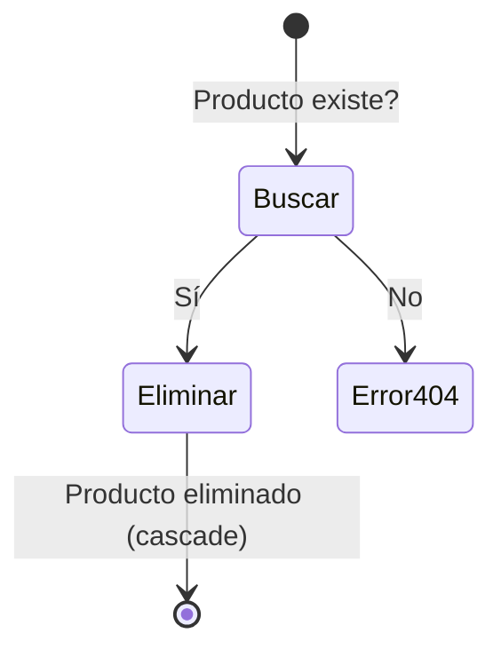
## Caso de Uso 15: Forzar Recálculo Manual

| Campo                   | Detalle                                                                                                                                                                                                                                                                      |
| :---------------------- | :--------------------------------------------------------------------------------------------------------------------------------------------------------------------------------------------------------------------------------------------------------------------------- |
| **Nombre**              | Forzar Recálculo                                                                                                                                                                                                                                                             |
| **Actor Principal**     | Usuario operador                                                                                                                                                                                                                                                             |
| **Precondiciones**      | Ticket existe.                                                                                                                                                                                                                                                               |
| **Flujo Principal**     | 1. El usuario hace clic en "Recalcular" en la UI. 2. El sistema envía `POST /api/v1/tickets/{ticketId}/calculate`. 3. El sistema ejecuta el motor de cálculo (Template Method) y retorna el resumen actualizado. 4. Opcionalmente, si hay advertencia de umbral, la muestra. |
| **Flujos Alternativos** | **3a. Producto huérfano:** Error 400.                                                                                                                                                                                                                                        |
| **Postcondiciones**     | Ninguna.                                                                                                                                                                                                                                                                     |
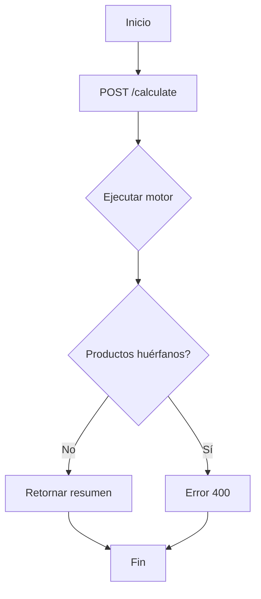
## Caso de Uso 16: Ver Historial de Tickets

| Campo                   | Detalle                                                                                                                                                                                                |
| :---------------------- | :----------------------------------------------------------------------------------------------------------------------------------------------------------------------------------------------------- |
| **Nombre**              | Ver Historial                                                                                                                                                                                          |
| **Actor Principal**     | Usuario operador                                                                                                                                                                                       |
| **Precondiciones**      | Existen tickets creados.                                                                                                                                                                               |
| **Flujo Principal**     | 1. El usuario navega a la sección de historial. 2. El sistema envía `GET /api/v1/history`. 3. Retorna lista de tickets con datos básicos (id, título, restaurante, total, fecha). 4. UI muestra tabla. |
| **Flujos Alternativos** | **3a. Sin historial:** Arreglo vacío, UI muestra estado vacío.                                                                                                                                         |
| **Postcondiciones**     | Ninguna.                                                                                                                                                                                               |
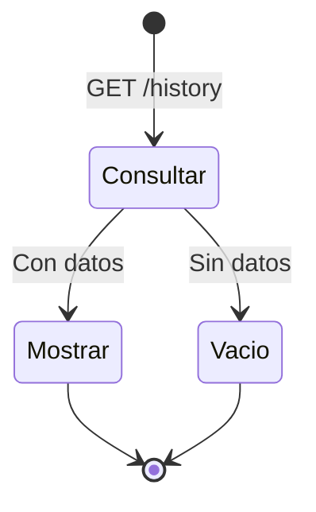
## Caso de Uso 17: Ver Detalle de Ticket Histórico

| Campo                   | Detalle                                                                                                                                                                                                                                |
| :---------------------- | :------------------------------------------------------------------------------------------------------------------------------------------------------------------------------------------------------------------------------------- |
| **Nombre**              | Ver Detalle Histórico                                                                                                                                                                                                                  |
| **Actor Principal**     | Usuario operador                                                                                                                                                                                                                       |
| **Precondiciones**      | Ticket existe en historial.                                                                                                                                                                                                            |
| **Flujo Principal**     | 1. El usuario selecciona un ticket del historial. 2. El sistema envía `GET /api/v1/history/{id}`. 3. Retorna detalle completo: ticket, participantes, productos, asignaciones, resumen calculado. 4. UI muestra vista de solo lectura. |
| **Flujos Alternativos** | **2a. Ticket no existe:** Error 404.                                                                                                                                                                                                   |
| **Postcondiciones**     | Ninguna.                                                                                                                                                                                                                               |
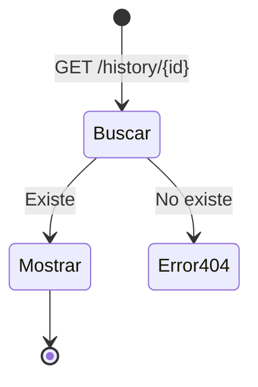
## Caso de Uso 18: Health Check

| Campo                   | Detalle                                                                                                                                                                    |
| :---------------------- | :------------------------------------------------------------------------------------------------------------------------------------------------------------------------- |
| **Nombre**              | Health Check                                                                                                                                                               |
| **Actor Principal**     | Sistema (monitoreo)                                                                                                                                                        |
| **Precondiciones**      | API en ejecución.                                                                                                                                                          |
| **Flujo Principal**     | 1. Se realiza `GET /api/v1/health`. 2. El sistema verifica conexión a BD, disponibilidad de OCR.Space (ping) y Gemini (ping). 3. Retorna JSON con estado de cada servicio. |
| **Flujos Alternativos** | **2a. BD caída:** Marca `database: "unhealthy"`. **2b. OCR no disponible:** Marca `ocr: "unhealthy"`. **2c. Gemini no disponible:** Marca `ai: "unhealthy"`.               |
| **Postcondiciones**     | Ninguna.                                                                                                                                                                   |
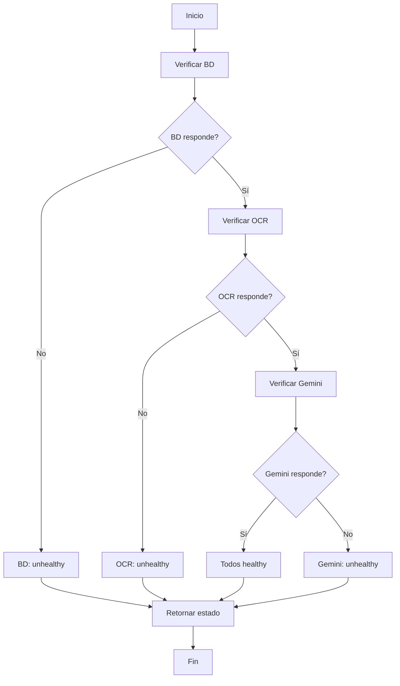
## Caso de Uso 19: Ingreso Manual de Productos tras Fallo de IA

| Campo                   | Detalle                                                                                                                                                                                                                                                                                                                                                                                        |
| :---------------------- | :--------------------------------------------------------------------------------------------------------------------------------------------------------------------------------------------------------------------------------------------------------------------------------------------------------------------------------------------------------------------------------------------- |
| **Nombre**              | Ingreso Manual tras Fallo de IA                                                                                                                                                                                                                                                                                                                                                                |
| **Actor Principal**     | Usuario operador                                                                                                                                                                                                                                                                                                                                                                               |
| **Precondiciones**      | Ticket en estado `FAILED` por error OCR o IA.                                                                                                                                                                                                                                                                                                                                                  |
| **Flujo Principal**     | 1. El sistema muestra mensaje de error claro (OCR_ERROR, AI_PARSE_ERROR). 2. El usuario agrega productos manualmente (Caso 12). 3. El usuario puede editar el ticket: restaurante, subtotal, IVA, descuento, total. 4. El usuario cambia manualmente el estado del ticket a `COMPLETED` (o se completa automáticamente al agregar el primer producto). 5. Continúa con asignaciones y cálculo. |
| **Flujos Alternativos** | **2a. El usuario decide reintentar:** Puede subir otra imagen.                                                                                                                                                                                                                                                                                                                                 |
| **Postcondiciones**     | Ticket en estado `COMPLETED` con productos manuales.                                                                                                                                                                                                                                                                                                                                           |
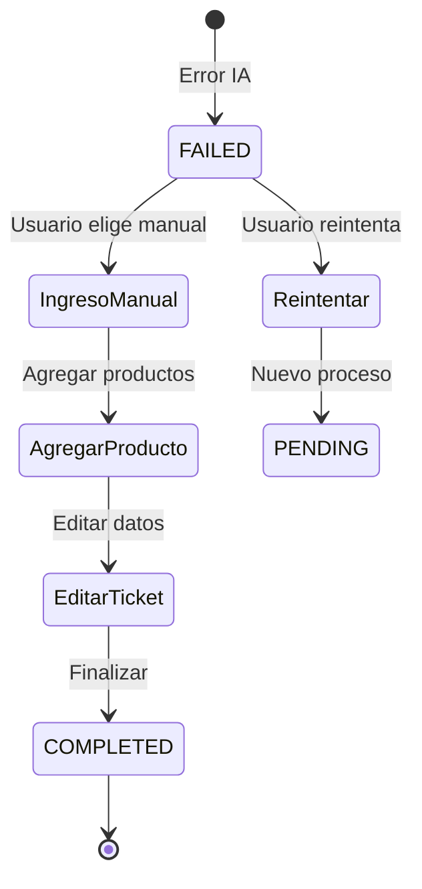
## Caso de Uso 20: Verificar Alerta de Diferencia de Total

| Campo                   | Detalle                                                                                                                                                                                                                                                                                                                 |
| :---------------------- | :---------------------------------------------------------------------------------------------------------------------------------------------------------------------------------------------------------------------------------------------------------------------------------------------------------------------- |
| **Nombre**              | Verificar Alerta de Diferencia de Total                                                                                                                                                                                                                                                                                 |
| **Actor Principal**     | Usuario operador                                                                                                                                                                                                                                                                                                        |
| **Precondiciones**      | Ticket existe. `CALC_TOTAL_VARIANCE_THRESHOLD` configurado.                                                                                                                                                                                                                                                             |
| **Flujo Principal**     | 1. El usuario solicita el resumen. 2. El sistema calcula `grandTotal`. 3. Compara `grandTotal` con `total` del ticket (impreso). 4. Si la diferencia absoluta supera el umbral, el sistema incluye una advertencia en la respuesta. 5. La UI muestra una alerta visual y permite al usuario editar valores manualmente. |
| **Flujos Alternativos** | **4a. Sin umbral configurado:** No se genera alerta.                                                                                                                                                                                                                                                                    |
| **Postcondiciones**     | El usuario puede ajustar subtotal, IVA, descuento o total manualmente.                                                                                                                                                                                                                                                  |
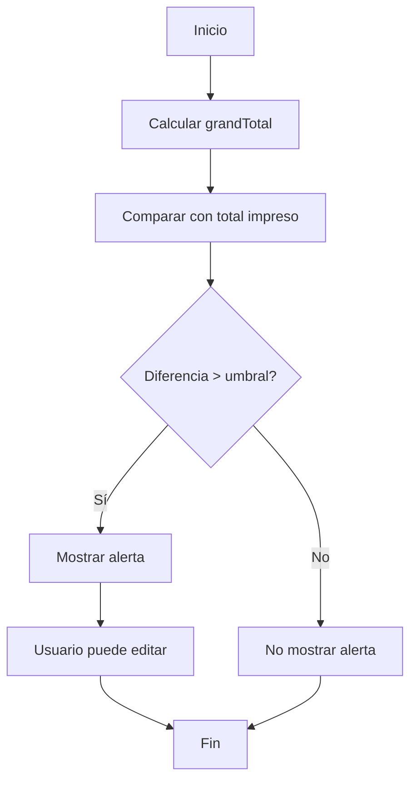
## Matriz de trazabilidad

| Origen (capacidad/UAT/actor/API)                                           | CU-#       | Actor            | Estado   |
| :------------------------------------------------------------------------- | :--------- | :--------------- | :------- |
| Capacidad: Gestión de grupos (POST /groups, GET /groups)                   | CU-1, CU-2 | Usuario operador | Cubierto |
| Capacidad: Gestión de participantes (POST /participants)                   | CU-3       | Usuario operador | Cubierto |
| Capacidad: Pipeline inteligente (POST /tickets/process)                    | CU-4       | Usuario operador | Cubierto |
| Capacidad: Agregar participante a ticket (POST /tickets/{id}/participants) | CU-5       | Usuario operador | Cubierto |
| Capacidad: Asignar producto individual (POST /assignments)                 |            |                  |          |

## Registro de cambios del documento

| Versión | Fecha | Descripción del cambio |
| --- | --- | --- |
| 1.0 | Julio 2026 | Creación inicial de Casos de uso |